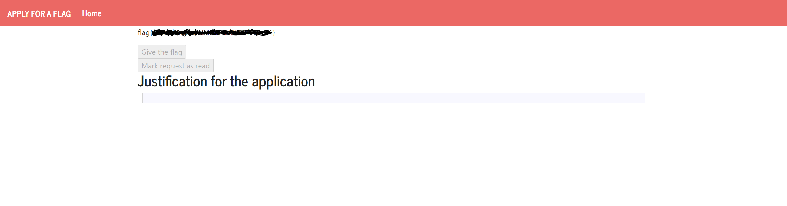

# SEED Labs - SQL Injection Attack Lab

## Task 1: Posting a Malicious Message to Display an Alert Window

## Task 2: Posting a Malicious Message to Display Cookies

## Task 3: Stealing Cookies from the Victim’s Machine

## Task 4: Becoming the Victim’s Friend


# CTF - Semanas 10 e 11

## Desafio 1

Ao entrar na página web, deparamo-nos com um form simples onde podemos inserir texto, que depois pode ser visto pelo administrador.

  


Se o input do form não for *sanitized*, então esta página fica vulnerável a um ataque XSS, uma vez que é possível colocar uma tag `<script>` no código html da página.

O objetivo é fazer o administrador clicar no botão "Give the flag", uma vez que o utilizador não autenticado não tem permissões para o fazer (mesmo que não esteja `disabled`)

```html
<form method="POST" action="" role="form">
    <div class="submit">     
        <input type="submit" id="giveflag" value="Give the flag" disabled="">      
    </div>
</form>
```

Então, vamos utilizar um script que realize essa ação ao carregar a página, de modo a que seja feito do lado do administrador.

```html
<script> window.onload = function(){document.getElementById('giveflag').click();} </script>
```

  




## Desafio 2

Ao explorar o site, encontramos algumas funcionalidades disponíveis a um utilizador não autenticado, que podemos tentar explorar. Nomeadamente existe funcionalidade que nos permite testar a nossa ligação a um ip específico.

 

Pela forma como é feito, percebemos que é usado o comando linux `ping`, ou seja, existe uma shell de linux a correr no servidor, à qual temos acesso. Sabendo pelo eunuciado que a flag se encontra em `/flags/flag.txt` vamos usar a shell para imprimir o conteúdo deste ficheiro, usando como input `0.0.0.0 | cat /flags/flag.txt`.

 


