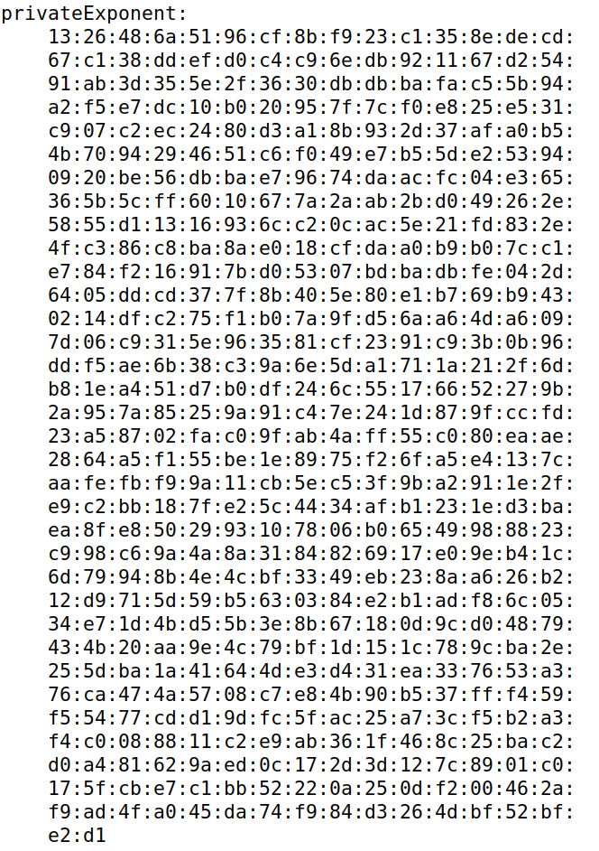
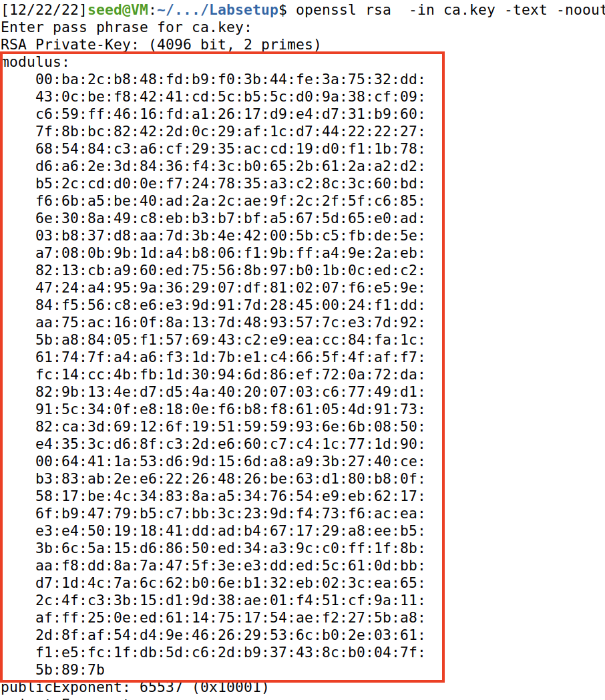
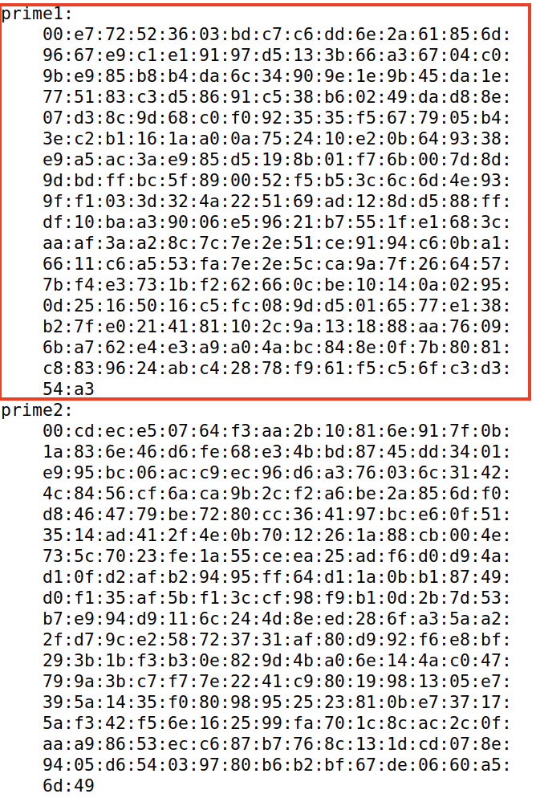
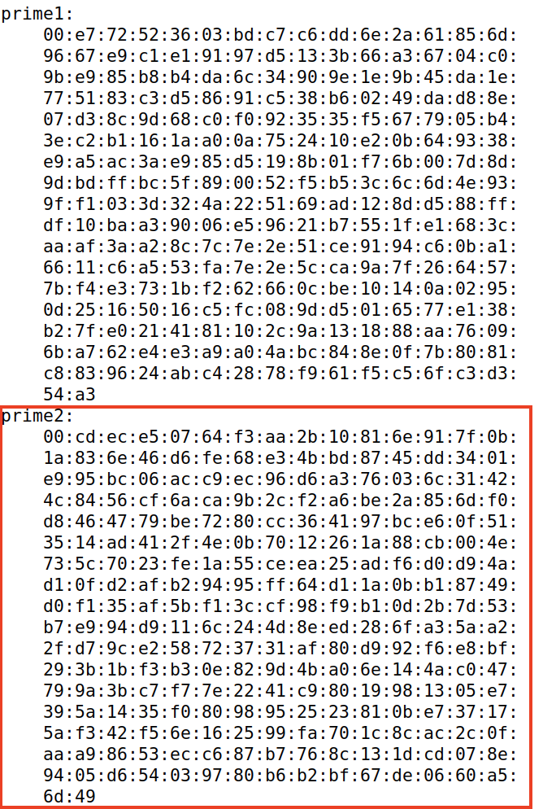

# SEED Labs - Public-Key Infrastructure (PKI) Lab

## Task 1: Becoming a Certificate Authority (CA)

Copiou-se o ficheiro de configuração `openssl.cnf` para o atual diretório, descomentou-se a linha `unique_subject` do mesmo e criou-se os sub-diretórios (`demoCA`, `certs`, `crl` e `newcerts`) e ficheiros (`index.txt` e `serial`) necessários com os seguintes comandos:

```sh
[12/22/22]seed@VM:~/.../Labsetup$ cp /usr/lib/ssl/openssl.cnf .
[12/22/22]seed@VM:~/.../Labsetup$ sudo vi openssl.cnf 
[12/22/22]seed@VM:~/.../Labsetup$ mkdir demoCA
[12/22/22]seed@VM:~/.../Labsetup$ cd demoCA
[12/22/22]seed@VM:~/.../demoCA$ mkdir certs crl newcerts
[12/22/22]seed@VM:~/.../demoCA$ touch index.txt serial
[12/22/22]seed@VM:~/.../demoCA$ echo 1000 > serial
```

Gerou-se o certificado _self-signed_, (especificando o `subject` e `password` na linha de comandos) com o comando:

```sh
[12/12/22]seed@VM:~/.../Labsetup$ openssl req -x509 -newkey rsa:4096 -sha256 -days 3650 -keyout ca.key -out ca.crt -subj "/CN=www.modelCA.com/O=Model CA LTD./C=US" -passout pass:dees
Generating a RSA private key
....................................++++
............................................++++
writing new private key to 'ca.key'
-----
```

Correu-se os comandos `openssl x509 -in ca.crt -text -noout` e `openssl rsa  -in ca.key -text -noout`, cujo _output_ permitiu responder às questões abaixo.

```sh
[12/22/22]seed@VM:~/.../Labsetup$ openssl x509 -in ca.crt -text -noout
Certificate:
    Data:
        Version: 3 (0x2)
        Serial Number:
            1c:ec:36:c3:cd:9e:61:2d:dc:b1:c3:f0:24:66:24:8b:59:5b:d9:57
        Signature Algorithm: sha256WithRSAEncryption
        Issuer: CN = www.modelCA.com, O = Model CA LTD., C = US
        Validity
            Not Before: Dec 22 19:02:03 2022 GMT
            Not After : Dec 19 19:02:03 2032 GMT
        Subject: CN = www.modelCA.com, O = Model CA LTD., C = US
        Subject Public Key Info:
            Public Key Algorithm: rsaEncryption
                RSA Public-Key: (4096 bit)
                Modulus:
                    00:ba:2c:b8:48:fd:b9:f0:3b:44:fe:3a:75:32:dd:
                    (...)
                Exponent: 65537 (0x10001)
        X509v3 extensions:
            X509v3 Subject Key Identifier: 
                96:AE:E1:73:3A:F7:84:2D:B7:B2:5D:16:23:C1:E8:12:0A:2A:2B:46
            X509v3 Authority Key Identifier: 
                keyid:96:AE:E1:73:3A:F7:84:2D:B7:B2:5D:16:23:C1:E8:12:0A:2A:2B:46

            X509v3 Basic Constraints: critical
                CA:TRUE
    Signature Algorithm: sha256WithRSAEncryption
         19:c8:b4:46:14:5a:37:99:f2:9f:b5:9b:33:80:3f:5d:10:b3:
        (...)
[12/22/22]seed@VM:~/.../Labsetup$ openssl rsa  -in ca.key -text -noout
Enter pass phrase for ca.key:
RSA Private-Key: (4096 bit, 2 primes)
modulus:
    00:ba:2c:b8:48:fd:b9:f0:3b:44:fe:3a:75:32:dd:
    (...)
publicExponent: 65537 (0x10001)
privateExponent:
    13:26:48:6a:51:96:cf:8b:f9:23:c1:35:8e:de:cd:
    (...)
prime1:
    00:e7:72:52:36:03:bd:c7:c6:dd:6e:2a:61:85:6d:
    (...)
prime2:
    00:cd:ec:e5:07:64:f3:aa:2b:10:81:6e:91:7f:0b:
    (...)
exponent1:
    57:4f:6e:2a:08:41:48:a3:01:97:74:8f:73:79:42:
    (...)
exponent2:
    3b:e5:29:80:8b:16:6c:6a:76:34:8f:6a:76:5f:4e:
    (...)
coefficient:
    00:d4:04:c3:f8:4d:be:3b:9e:dc:99:bc:5b:75:86:
    (...)
```

- What part of the certificate indicates this is a CA’s certificate?

`CA:TRUE` (X509v3 Basic Constraints).

- What part of the certificate indicates this is a self-signed certificate?

Como o `X509v3 Subject Key Identifier` é **igual** ao `X509v3 Authority Key Identifier`, então é um certificado _self-signed_.

- In the RSA algorithm, we have a public exponent e, a private exponent d, a modulus n, and two secret numbers p and q, such that n = pq. Please identify the values for these elements in your certificate and key files.

    - public exponent e: `65537 (0x10001)`

    - private exponent d

     

    - modulus n

     

    - secret number p

     

    - secret number q

     

## Task 2: Generating a Certificate Request for Your Web Server

Gerou-se o CSR para `www.l06g032022.com` com dois nomes alternativos (`www.l06g032022.pt` e `www.l06g032022.net`) com o seguinte comando:

```sh
[12/22/22]seed@VM:~/.../Labsetup$ openssl req -newkey rsa:2048 -sha256  \
>     -keyout server.key   -out server.csr  \
>     -subj "/CN=www.l06g032022.com/O=L06G032022 Inc./C=US" \
>     -passout pass:dees \
>     -addext "subjectAltName = DNS:www.l06g032022.com,  \
>                             DNS:www.l06g032022.pt, \
>                             DNS:www.l06g032022.net"
Generating a RSA private key
.................................+++++
........+++++
writing new private key to 'server.key'
-----
```

Com o comando `openssl req -in server.csr -text -noout` é possível verificar o seu conteúdo.

```sh
[12/22/22]seed@VM:~/.../Labsetup$ openssl req -in server.csr -text -noout
Certificate Request:
    Data:
        Version: 1 (0x0)
        Subject: CN = www.l06g032022.com, O = L06G032022 Inc., C = US
        Subject Public Key Info:
            Public Key Algorithm: rsaEncryption
                RSA Public-Key: (2048 bit)
                Modulus:
                    00:a9:c6:5c:1b:25:73:a0:29:5f:bc:87:d8:07:d8:
                    (...)
                Exponent: 65537 (0x10001)
        Attributes:
        Requested Extensions:
            X509v3 Subject Alternative Name: 
                DNS:www.l06g032022.com, DNS:www.l06g032022.pt, DNS:www.l06g032022.net
    Signature Algorithm: sha256WithRSAEncryption
         27:45:30:64:3b:af:8c:c7:0f:51:8a:14:9b:4d:1e:07:a3:27:
        (...)
```

## Task 3: Generating a Certificate for your server

## Task 4: Deploying Certificate in an Apache-Based HTTPS Website

## Task 5: Launching a Man-In-The-Middle Attack

## Task 6: Launching a Man-In-The-Middle Attack with a Compromised CA

# CTF - Semanas 12 e 13

## Desafio 1  

A mensagem recebida do servidor foi encriptada por RSA. Sobre a chave sabemos que `e = 0x10001` (65537 em decimal) e que os números primos usados são os menores números primos maiores que 2^512 e 2^513, respetivamente. Usamos o [WolframAlpha](https://www.wolframalpha.com/input?i=nextprime%282%5E512%29) para saber estes valores. De forma semelhante usamos [esta aplicação](https://www.wolframalpha.com/input?i=solve+%28d+*+65537%29+mod+%28+%28nextprime%282%5E512%29+-+1%29+*+%28nextprime%282%5E513%29+-+1%29+%29+%3D+1) para resolver a equação `d*e mod ((p-1)*(q-1)) = 1` (também poderia ser usada a equação `d*e mod lcm((p-1),(q-1)) = 1`), de modo a obter o valor de `d`.  

Assim, usando como base o ficheiro `template.py` fornecido, corremos este script de modo a descodificar a mensagem e obter a flag.

`rsa.py`  
```python
from binascii import hexlify, unhexlify

p = 13407807929942597099574024998205846127479365820592393377723561443721764030073546976801874298166903427690031858186486050853753882811946569946433649006084171 # next prime 2**512
q = 26815615859885194199148049996411692254958731641184786755447122887443528060147093953603748596333806855380063716372972101707507765623893139892867298012168351 # next prime 2**513
n = p*q
e = 0x10001 # a constant
d = 643364410957805128239433625705788478525355186387845396354027981372683647092131603505260273159610570267324385157518895074010688696710959627984304949368548745330254893993233372950752498045636757937769711210381876043694354367231083760486614175252253794208033778926333821555015473141751364815656741815522983488973   # a number such that d*e % ((p-1)*(q-1)) = 1


enc_flag = "0000000000000000000000000000000000000000000000000000000000000000000000000000000000000000000000000000000000000000000000000000000000000000000000000000000000000000000000000000000000000000000000000000000000000000000000000000000000000000000000000000000000000000f849043cd903fd4dae4f54f6ed5f0aeda5c4cf01af49d5333b4d347ff2233ef27a416164018d22150c088f3e2de4b6849c81090a405dd05c0f410c5b9a8d77ebd72ec0534bc49724862df4691c07739328753c905bb503665cccf9eb787fe76282962ce1c80168ed506afa43aa4471165021365b99c7c32d4cf8af271fac0368"

def enc(x):
	int_x = int.from_bytes(x, "big")
	y = pow(int_x,e,n)
	return hexlify(y.to_bytes(256, 'big'))

def dec(y):
	int_y = int.from_bytes(unhexlify(y), "big")
	x = pow(int_y,d,n)
	return x.to_bytes(256, 'big')

y = dec(enc_flag)
print(y.decode('latin-1'))
```

## Desafio 2
