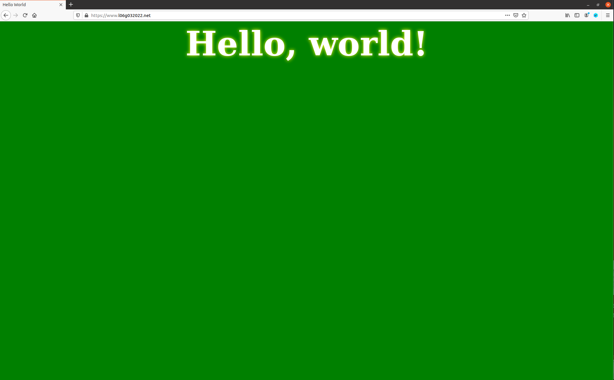
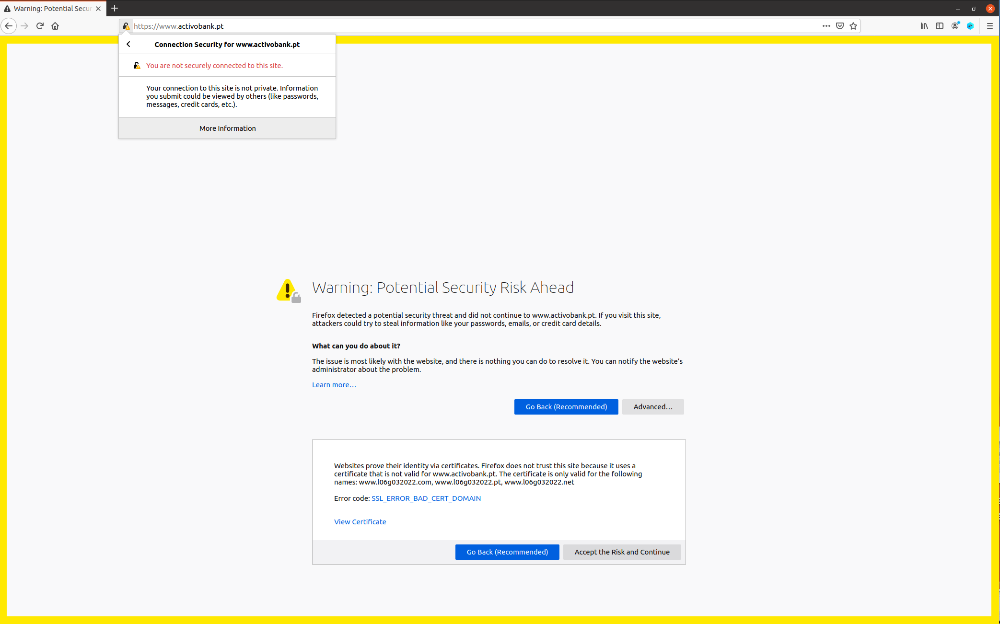
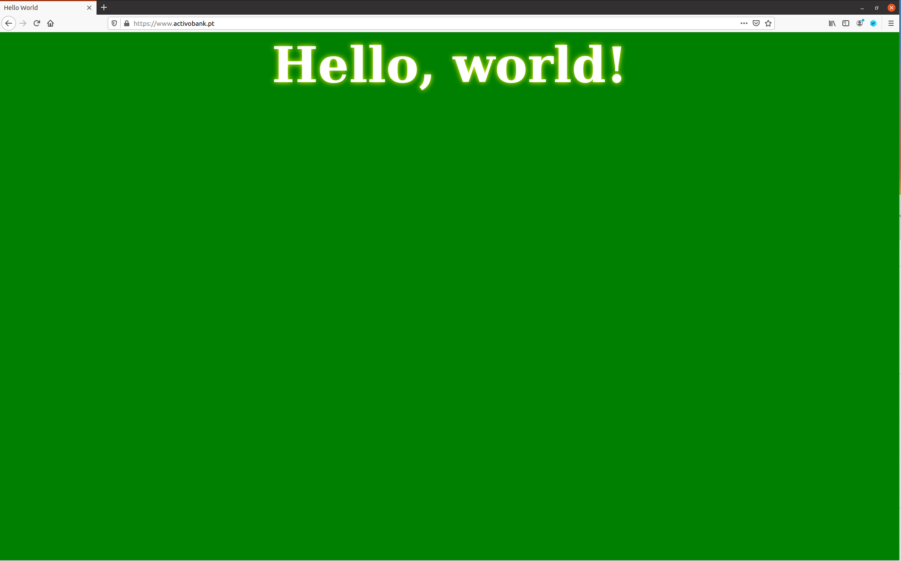

# SEED Labs - Public-Key Infrastructure (PKI) Lab

## Task 1: Becoming a Certificate Authority (CA)

Copiou-se o ficheiro de configuração `openssl.cnf` para o atual diretório, descomentou-se a linha `unique_subject` do mesmo e criou-se os sub-diretórios (`demoCA`, `certs`, `crl` e `newcerts`) e ficheiros (`index.txt` e `serial`) necessários com os seguintes comandos:

```sh
[12/22/22]seed@VM:~/.../Labsetup$ cp /usr/lib/ssl/openssl.cnf .
[12/22/22]seed@VM:~/.../Labsetup$ sudo vi openssl.cnf 
[12/22/22]seed@VM:~/.../Labsetup$ mkdir demoCA
[12/22/22]seed@VM:~/.../Labsetup$ cd demoCA
[12/22/22]seed@VM:~/.../demoCA$ mkdir certs crl newcerts
[12/22/22]seed@VM:~/.../demoCA$ touch index.txt serial
[12/22/22]seed@VM:~/.../demoCA$ echo 1000 > serial
```

Gerou-se o certificado _self-signed_, (especificando o `subject` e `password` na linha de comandos) com o comando:

```sh
[12/12/22]seed@VM:~/.../Labsetup$ openssl req -x509 -newkey rsa:4096 -sha256 -days 3650 -keyout ca.key -out ca.crt -subj "/CN=www.modelCA.com/O=Model CA LTD./C=US" -passout pass:dees
Generating a RSA private key
....................................++++
............................................++++
writing new private key to 'ca.key'
-----
```

Correu-se os comandos `openssl x509 -in ca.crt -text -noout` e `openssl rsa  -in ca.key -text -noout`, cujo _output_ permitiu responder às questões abaixo.

```sh
[12/22/22]seed@VM:~/.../Labsetup$ openssl x509 -in ca.crt -text -noout
Certificate:
    Data:
        Version: 3 (0x2)
        Serial Number:
            1c:ec:36:c3:cd:9e:61:2d:dc:b1:c3:f0:24:66:24:8b:59:5b:d9:57
        Signature Algorithm: sha256WithRSAEncryption
        Issuer: CN = www.modelCA.com, O = Model CA LTD., C = US
        Validity
            Not Before: Dec 22 19:02:03 2022 GMT
            Not After : Dec 19 19:02:03 2032 GMT
        Subject: CN = www.modelCA.com, O = Model CA LTD., C = US
        Subject Public Key Info:
            Public Key Algorithm: rsaEncryption
                RSA Public-Key: (4096 bit)
                Modulus:
                    00:ba:2c:b8:48:fd:b9:f0:3b:44:fe:3a:75:32:dd:
                    (...)
                Exponent: 65537 (0x10001)
        X509v3 extensions:
            X509v3 Subject Key Identifier: 
                96:AE:E1:73:3A:F7:84:2D:B7:B2:5D:16:23:C1:E8:12:0A:2A:2B:46
            X509v3 Authority Key Identifier: 
                keyid:96:AE:E1:73:3A:F7:84:2D:B7:B2:5D:16:23:C1:E8:12:0A:2A:2B:46

            X509v3 Basic Constraints: critical
                CA:TRUE
    Signature Algorithm: sha256WithRSAEncryption
         19:c8:b4:46:14:5a:37:99:f2:9f:b5:9b:33:80:3f:5d:10:b3:
        (...)
[12/22/22]seed@VM:~/.../Labsetup$ openssl rsa  -in ca.key -text -noout
Enter pass phrase for ca.key:
RSA Private-Key: (4096 bit, 2 primes)
modulus:
    00:ba:2c:b8:48:fd:b9:f0:3b:44:fe:3a:75:32:dd:
    (...)
publicExponent: 65537 (0x10001)
privateExponent:
    13:26:48:6a:51:96:cf:8b:f9:23:c1:35:8e:de:cd:
    (...)
prime1:
    00:e7:72:52:36:03:bd:c7:c6:dd:6e:2a:61:85:6d:
    (...)
prime2:
    00:cd:ec:e5:07:64:f3:aa:2b:10:81:6e:91:7f:0b:
    (...)
exponent1:
    57:4f:6e:2a:08:41:48:a3:01:97:74:8f:73:79:42:
    (...)
exponent2:
    3b:e5:29:80:8b:16:6c:6a:76:34:8f:6a:76:5f:4e:
    (...)
coefficient:
    00:d4:04:c3:f8:4d:be:3b:9e:dc:99:bc:5b:75:86:
    (...)
```

- What part of the certificate indicates this is a CA’s certificate?

`CA:TRUE` (X509v3 Basic Constraints).

- What part of the certificate indicates this is a self-signed certificate?

Como o `X509v3 Subject Key Identifier` é **igual** ao `X509v3 Authority Key Identifier`, então é um certificado _self-signed_.

- In the RSA algorithm, we have a public exponent e, a private exponent d, a modulus n, and two secret numbers p and q, such that n = pq. Please identify the values for these elements in your certificate and key files.

    - public exponent e: `65537 (0x10001)`

    - private exponent d

     

    - modulus n

     

    - secret number p

     

    - secret number q

     

## Task 2: Generating a Certificate Request for Your Web Server

Gerou-se o CSR para `www.l06g032022.com` com dois nomes alternativos (`www.l06g032022.pt` e `www.l06g032022.net`) com o seguinte comando:

```sh
[12/22/22]seed@VM:~/.../Labsetup$ openssl req -newkey rsa:2048 -sha256  \
>     -keyout server.key   -out server.csr  \
>     -subj "/CN=www.l06g032022.com/O=L06G032022 Inc./C=US" \
>     -passout pass:dees \
>     -addext "subjectAltName = DNS:www.l06g032022.com,  \
>                             DNS:www.l06g032022.pt, \
>                             DNS:www.l06g032022.net"
Generating a RSA private key
.................................+++++
........+++++
writing new private key to 'server.key'
-----
```

Com o comando `openssl req -in server.csr -text -noout` é possível verificar o conteúdo do ficheiro CSR - `server.csr`.

```sh
[12/22/22]seed@VM:~/.../Labsetup$ openssl req -in server.csr -text -noout
Certificate Request:
    Data:
        Version: 1 (0x0)
        Subject: CN = www.l06g032022.com, O = L06G032022 Inc., C = US
        Subject Public Key Info:
            Public Key Algorithm: rsaEncryption
                RSA Public-Key: (2048 bit)
                Modulus:
                    00:a9:c6:5c:1b:25:73:a0:29:5f:bc:87:d8:07:d8:
                    (...)
                Exponent: 65537 (0x10001)
        Attributes:
        Requested Extensions:
            X509v3 Subject Alternative Name: 
                DNS:www.l06g032022.com, DNS:www.l06g032022.pt, DNS:www.l06g032022.net
    Signature Algorithm: sha256WithRSAEncryption
         27:45:30:64:3b:af:8c:c7:0f:51:8a:14:9b:4d:1e:07:a3:27:
        (...)
```

## Task 3: Generating a Certificate for your server

Depois de descomentar a linha `copy_extensions = copy` no ficheiro de configuração `openssl.cnf`, foi possível transformar o CSR (`server.csr`) num certificado X509 (`server.crt`) usando o seguinte comando:

```sh
[12/22/22]seed@VM:~/.../Labsetup$ openssl ca -config openssl.cnf -policy policy_anything \
>            -md sha256 -days 3650 \
>            -in server.csr -out server.crt -batch \
>            -cert ca.crt -keyfile ca.key
Using configuration from openssl.cnf
Enter pass phrase for ca.key:
Check that the request matches the signature
Signature ok
Certificate Details:
        Serial Number: 4096 (0x1000)
        Validity
            Not Before: Dec 22 22:11:58 2022 GMT
            Not After : Dec 19 22:11:58 2032 GMT
        Subject:
            countryName               = US
            organizationName          = L06G032022 Inc.
            commonName                = www.l06g032022.com
        X509v3 extensions:
            X509v3 Basic Constraints: 
                CA:FALSE
            Netscape Comment: 
                OpenSSL Generated Certificate
            X509v3 Subject Key Identifier: 
                FD:61:81:3B:20:39:9E:2F:E8:FD:45:1E:C8:6E:74:CB:1F:55:E6:8E
            X509v3 Authority Key Identifier: 
                keyid:96:AE:E1:73:3A:F7:84:2D:B7:B2:5D:16:23:C1:E8:12:0A:2A:2B:46

            X509v3 Subject Alternative Name: 
                DNS:www.l06g032022.com, DNS:www.l06g032022.pt, DNS:www.l06g032022.net
Certificate is to be certified until Dec 19 22:11:58 2032 GMT (3650 days)

Write out database with 1 new entries
Data Base Updated
```

Tal como é sugerido, com o comando `openssl x509 -in server.crt -text -noout` verificou-se em `X509v3 Subject Alternative Name` que os nomes alternativos (`www.l06g032022.com`, `www.l06g032022.pt` e `www.l06g032022.net`) estão incluídos no certificado. 

```sh
[12/22/22]seed@VM:~/.../Labsetup$ openssl x509 -in server.crt -text -noout
Certificate:
    Data:
        Version: 3 (0x2)
        Serial Number: 4096 (0x1000)
        Signature Algorithm: sha256WithRSAEncryption
        Issuer: CN = www.modelCA.com, O = Model CA LTD., C = US
        Validity
            Not Before: Dec 22 22:11:58 2022 GMT
            Not After : Dec 19 22:11:58 2032 GMT
        Subject: C = US, O = L06G032022 Inc., CN = www.l06g032022.com
        Subject Public Key Info:
            Public Key Algorithm: rsaEncryption
                RSA Public-Key: (2048 bit)
                Modulus:
                    00:a9:c6:5c:1b:25:73:a0:29:5f:bc:87:d8:07:d8:
                    (...)
                Exponent: 65537 (0x10001)
        X509v3 extensions:
            X509v3 Basic Constraints: 
                CA:FALSE
            Netscape Comment: 
                OpenSSL Generated Certificate
            X509v3 Subject Key Identifier: 
                FD:61:81:3B:20:39:9E:2F:E8:FD:45:1E:C8:6E:74:CB:1F:55:E6:8E
            X509v3 Authority Key Identifier: 
                keyid:96:AE:E1:73:3A:F7:84:2D:B7:B2:5D:16:23:C1:E8:12:0A:2A:2B:46

            X509v3 Subject Alternative Name: 
                DNS:www.l06g032022.com, DNS:www.l06g032022.pt, DNS:www.l06g032022.net
    Signature Algorithm: sha256WithRSAEncryption
         36:ec:4a:75:c1:0a:52:ba:40:16:fd:0a:39:0f:a0:6a:91:c7:
        (...)
```

## Task 4: Deploying Certificate in an Apache-Based HTTPS Website

Seguiu-se o exemplo fornecido para fazer as alterações necessárias no `Dockerfile` e criar o ficheiro `l06g032022_apache_ssl.conf` (baseado no `bank32 apache ssl.conf`), cuja explicação já se encontra no guião, daí ser aqui omitida. Os campos `DocumentRoot`, `ServerName`, `ServerAlias`, `SSLCertificateFile` e `SSLCertificateKeyFile` (do ficheiro `bank32 apache ssl.conf`) foram modificados, para além dos ficheiros `server.crt` e `server.key` terem sido copiados para a pasta `image_www/certs`.

- l06g032022_apache_ssl.conf 

```conf
<VirtualHost *:443> 
    DocumentRoot /var/www/l06g032022
    ServerName www.l06g032022.com
    ServerAlias www.l06g032022.pt
    ServerAlias www.l06g032022.net
    DirectoryIndex index.html
    SSLEngine On 
    SSLCertificateFile /certs/server.crt
    SSLCertificateKeyFile /certs/server.key
</VirtualHost>

<VirtualHost *:80> 
    DocumentRoot /var/www/l06g032022
    ServerName www.l06g032022.com
    DirectoryIndex index_red.html
</VirtualHost>

# Set the following gloal entry to suppress an annoying warning message
ServerName localhost
```

- Dockerfile

```dockerfile
FROM handsonsecurity/seed-server:apache-php

ARG WWWDIR=/var/www/l06g032022

COPY ./index.html ./index_red.html $WWWDIR/
COPY ./l06g032022_apache_ssl.conf /etc/apache2/sites-available
COPY ./certs/server.crt ./certs/server.key  /certs/

RUN  chmod 400 /certs/server.key \
     && chmod 644 $WWWDIR/index.html \
     && chmod 644 $WWWDIR/index_red.html \
     && a2ensite l06g032022_apache_ssl   

CMD  tail -f /dev/null
```

Para iniciar o servidor Apache utilizou-se o comando `service apache2 start`.

```sh
[12/22/22]seed@VM:~/.../Labsetup$ dockps
ea37c7b1beb5  www-10.9.0.80
[12/22/22]seed@VM:~/.../Labsetup$ docksh ea
root@ea37c7b1beb5:/# service apache2 start
 * Starting Apache httpd web server apache2
Enter passphrase for SSL/TLS keys for www.l06g032022.com:443 (RSA):
 * 
root@ea37c7b1beb5:/#
``` 

Ao tentar aceder a `https://www.l06g032022.com`, usando o _browser_ Firefox, é possível visualizar a mensagem de aviso `"Warning: Potential Security Risk Ahead"` cujo código de erro é `SEC_ERROR_UNKNOWN_ISSUER`.


Isto acontece, porque o _browser_ (Firefox) não conhece o emissor do certificado usado por `www.l06g032022.com`, neste caso `Model CA LTD.` (task 1). Isto é, `Model CA LTD.` não está na lista de CAs confiáveis do _browser_, logo nenhum certificado emitido por esse CA será de confiança. No entanto, é possível adicionar manualmente `Model CA LTD.` - ficheiro `ca.crt`- à lista, tal como é explicado no guião e nos seguintes _screenshots_.

 

 

Assim, é possível aceder a `https://www.l06g032022.com` e aos nomes alternativos (`https://www.l06g032022.pt` e `https://www.l06g032022.net`) sem ser apresentada qualquer mensagem de aviso, como se pode confirmar nos _screenshots_ abaixo.

 

 

 


## Task 5: Launching a Man-In-The-Middle Attack

O _website_ escolhido foi `www.activobank.pt` e modificou-se o campo `ServerName` do ficheiro `l06g032022_apache_ssl.conf`, utilizado na `task 4`, como é sugerido:

```conf
<VirtualHost *:443> 
    DocumentRoot /var/www/l06g032022
    ServerName www.activobank.pt
    ServerAlias www.l06g032022.pt
    ServerAlias www.l06g032022.net
    DirectoryIndex index.html
    SSLEngine On 
    SSLCertificateFile /certs/server.crt
    SSLCertificateKeyFile /certs/server.key
</VirtualHost>

<VirtualHost *:80> 
    DocumentRoot /var/www/l06g032022
    ServerName www.l06g032022.com
    DirectoryIndex index_red.html
</VirtualHost>

# Set the following gloal entry to suppress an annoying warning message
ServerName localhost
```

Foi acrescentada a linha seguinte `/etc/hosts` [...]

 

## Task 6: Launching a Man-In-The-Middle Attack with a Compromised CA

 

# CTF - Semanas 12 e 13

## Desafio 1  

A mensagem recebida do servidor foi encriptada por RSA. Sobre a chave sabemos que `e = 0x10001` (65537 em decimal) e que os números primos usados são os menores números primos maiores que 2^512 e 2^513, respetivamente. Usamos o [WolframAlpha](https://www.wolframalpha.com/input?i=nextprime%282%5E512%29) para saber estes valores. De forma semelhante usamos [esta aplicação](https://www.wolframalpha.com/input?i=solve+%28d+*+65537%29+mod+%28+%28nextprime%282%5E512%29+-+1%29+*+%28nextprime%282%5E513%29+-+1%29+%29+%3D+1) para resolver a equação `d*e mod ((p-1)*(q-1)) = 1` (também poderia ser usada a equação `d*e mod lcm((p-1),(q-1)) = 1`), de modo a obter o valor de `d`.  

Assim, usando como base o ficheiro `template.py` fornecido, corremos este script de modo a descodificar a mensagem e obter a flag.

`rsa.py`  
```python
from binascii import hexlify, unhexlify

p = 13407807929942597099574024998205846127479365820592393377723561443721764030073546976801874298166903427690031858186486050853753882811946569946433649006084171 # next prime 2**512
q = 26815615859885194199148049996411692254958731641184786755447122887443528060147093953603748596333806855380063716372972101707507765623893139892867298012168351 # next prime 2**513
n = p*q
e = 0x10001 # a constant
d = 643364410957805128239433625705788478525355186387845396354027981372683647092131603505260273159610570267324385157518895074010688696710959627984304949368548745330254893993233372950752498045636757937769711210381876043694354367231083760486614175252253794208033778926333821555015473141751364815656741815522983488973   # a number such that d*e % ((p-1)*(q-1)) = 1


enc_flag = "0000000000000000000000000000000000000000000000000000000000000000000000000000000000000000000000000000000000000000000000000000000000000000000000000000000000000000000000000000000000000000000000000000000000000000000000000000000000000000000000000000000000000000f849043cd903fd4dae4f54f6ed5f0aeda5c4cf01af49d5333b4d347ff2233ef27a416164018d22150c088f3e2de4b6849c81090a405dd05c0f410c5b9a8d77ebd72ec0534bc49724862df4691c07739328753c905bb503665cccf9eb787fe76282962ce1c80168ed506afa43aa4471165021365b99c7c32d4cf8af271fac0368"

def enc(x):
	int_x = int.from_bytes(x, "big")
	y = pow(int_x,e,n)
	return hexlify(y.to_bytes(256, 'big'))

def dec(y):
	int_y = int.from_bytes(unhexlify(y), "big")
	x = pow(int_y,d,n)
	return x.to_bytes(256, 'big')

y = dec(enc_flag)
print(y.decode('latin-1'))
```

## Desafio 2

Desta vez eram-nos dadas pelo servidor duas mensagens, iguais em conteúdo, encriptadas por RSA com chaves públicas diferentes, mas com o mesmo `n`.  
Assim, procuramos por soluções para este problema, que passam por resolver um sistema de equações modulares.  
Esta foi a solução seguida: https://crypto.stackexchange.com/questions/1614/rsa-cracking-the-same-message-is-sent-to-two-different-people-problem.  

`rsa.py`
```python
from binascii import hexlify, unhexlify

def enc(x):
	int_x = int.from_bytes(x, "big")
	y = pow(int_x,e,n)
	return hexlify(y.to_bytes(256, 'big'))

def dec(y):
	int_y = int.from_bytes(unhexlify(y), "big")
	x = pow(int_y,d,n)
	return x.to_bytes(256, 'big')

n = 29802384007335836114060790946940172263849688074203847205679161119246740969024691447256543750864846273960708438254311566283952628484424015493681621963467820718118574987867439608763479491101507201581057223558989005313208698460317488564288291082719699829753178633499407801126495589784600255076069467634364857018709745459288982060955372620312140134052685549203294828798700414465539743217609556452039466944664983781342587551185679334642222972770876019643835909446132146455764152958176465019970075319062952372134839912555603753959250424342115581031979523075376134933803222122260987279941806379954414425556495125737356327411

e1 = 0x10001 # 65537

c1 = b'6da84b7647aa1657b2d9343a790576eae8f75f163cf5a2ee82a5bce60daceda659d8007543b1d47d69d3a239b61a25c218e62f4961a98681772db5f2b41676a99bd4a6d11ba22d8f4b44d405e466f19b3fc2c0730ff6b95318427fb980828dea03feb5a83c8f81abd3678a711978d91802c67418a910e9c0ca1aab7bac058aa4ea87286071df59b97b28af562a3a2e5bcb73037b8673cb53128879479a56b556b04ad45a8f7a8624fd38bd6290c1a4c91a17327471ddb696ef1bd12d7cd6a5510f1240507f2004d54c7c654c30ae9f93848b8ea5ae8559d8e491fd2509d4b4896f166d47fa1cad4f07c0deebe1e9c50ba34f793741e5254ad790415f696d8f97'

int_c1 = int.from_bytes(unhexlify(c1), "big")

e2 = 0x10003 # 65539

c2 = b'1a8a33e34963bf3acb6f9eb1b34b7f2bb11a1e295c83e66c30378ad036d6576e90e4e06bd0495a5b3838236a4ed70579907081561a07a9ea5fa52868eb09d3698653ec8b949ce082ac37599ee1ad5528eedf02e9bd1d6bcdd2b9e88d61d8326f25bd962b16419705b5444a7a94e0563a139e358fb6351bb0afba02e069427a0bac4d490598db1ce8c0b1a0e87c0e2f0214f15b8b9275f1634387a48c065e452a8659f960d6bfa24123da1689cce8e1934e1b083351ddefe29f0bd72e1eae9d9280090938023dd1ab7ce000098359debe954294fa451f1fc623bab5fabdcca071aa41f4349608d8aad7ce3e84a0ae0d4ae241c7cd6fbe38f3ff0a7631ae5ffcb8'

int_c2 = int.from_bytes(unhexlify(c2), "big")

# gcd(e1, e2) = 1
# a*e1 + b*e2 = 1
# https://www.wolframalpha.com/input?i=solve+a*65537+%2B+b*65539+%3D+1+for+a%2C+b+integer
a = 32769
b = -32768

def modInverse(A, M):
    m0 = M
    y = 0
    x = 1
 
    if (M == 1):
        return 0
 
    while (A > 1):
 
        # q is quotient
        q = A // M
 
        t = M
 
        # m is remainder now, process
        # same as Euclid's algo
        M = A % M
        A = t
        t = y
 
        # Update x and y
        y = x - q * y
        x = t
 
    # Make x positive
    if (x < 0):
        x = x + m0
 
    return x


i = modInverse(int_c2, n)

m = ((int_c1**a) * (i**(-b))) % n 

m = m.to_bytes(256, 'big')
print(m.decode('latin-1'))
```

